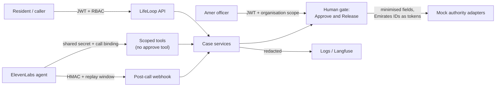

# Security policy

## About this project

LifeLoop is a **prototype** created by Team Symphony for the **"Ignyte × ElevenLabs Voice Agent Challenge"**
(Track 2 Government Services, use case 7: Life-Event Service Orchestration; target market Dubai, UAE). It
demonstrates a voice agent that coordinates the post-birth document chain for expatriate parents: birth
certificate, MOFA attestation, the home-country consulate passport, residence visa, Emirates ID and insurance.

It is **not a production system**, it is **not operated by or connected to any UAE government entity**, and every
government integration in it is a **mock**. Do not enter real personal data into a demo instance.

This document summarises how the prototype protects the data it handles, what it deliberately does not do, and how
to report a vulnerability. The detailed documents are:

- [Threat model](docs/security/threat-model.md): assets, actors, trust boundaries, STRIDE analysis
- [PII handling](docs/security/pii-handling.md): what is stored, hashed, redacted, and never stored
- [Incident response](docs/security/incident-response.md): detect, contain, recover, notify
- [Guardrails](docs/agent/guardrails.md): each canvas guardrail with its mechanism, code path and test

## Security architecture

Principles:

1. **AI prepares, officers release, authorities decide.** The agent cannot approve, release or reject anything.
2. **LifeLoop never invents government status.** Status changes only through the authority adapter contract.
3. **Least data across every boundary.** Each authority receives only its own form's fields.
4. **Fail closed.** Missing consent blocks calls; missing secrets in production stop the service from starting or
   reject the request.
5. **Every decision is attributable.** Officer actions, agent tool calls and denials are audited with actor, trace
   id and request id.

## Threat model summary

The main threats considered are: impersonation of the parent on a callback; scam calls impersonating LifeLoop;
forged tool calls and webhooks; the LLM stating or causing an approval; officers acting outside their service
centre; identifiers leaking into logs, traces or authority requests; and dependency outages turning into false
statuses. Each has a control in code, listed with its residual risk in the
[threat model](docs/security/threat-model.md#stride-analysis).

## Personal data (PII)

- **Emirates IDs** are validated, then stored only as a keyed HMAC-SHA256 hash (key `PII_HASH_KEY`, separate from
  the JWT signing key) plus the last four digits. They are sent to authorities only as opaque tokens, never read
  aloud, never repeated back, and never requested on a callback. During voice intake they are held in the cache for
  at most 30 minutes until hashed.
- **Caller IDs** of calls to the life-event number are used to bind the call to a resident; a first-time caller
  becomes a phone-only resident with a masked display name and no password.
- **Passport numbers are never stored**: only whether the number is available.
- Transcripts, webhook payloads, event payloads, audit details, logs and traces are **redacted** before storage or
  export (Emirates IDs, passport-like numbers, phone numbers, emails, tokens and secrets).
- Officers see Emirates IDs as "ending NNNN"; residents see a masked form; phone numbers are masked in views.

Details: [PII handling](docs/security/pii-handling.md).

## Voice recordings

LifeLoop **does not record or store call audio**. Every call opens with a fixed disclosure that the agent is an AI
and that the call is recorded, because calls handled by ElevenLabs may be recorded and retained by ElevenLabs under
the ElevenLabs workspace's settings. LifeLoop stores only **redacted transcripts**, a call summary, extracted
fields, and a reference to the provider conversation. Audio sent to the speech-to-text endpoint is transcribed and
not kept.

## Consent

Consent is a first-class record (type, status, scope text, version, source, language, timestamp, call reference).
Processing and filing consent are required to open a case. A **callback consent token** is required for every
outbound call; the callback engine checks it when a callback is scheduled and again when it is dialled. Withdrawing
consent cancels pending callbacks; turning calls back on requires a fresh consent.

## Callback and phone-line security

- No consent token → no call (`BLOCKED_NO_CONSENT`). Opted out → no call; an SMS with the case reference instead.
- "Stop calling" is recognised at any turn in all six languages and takes effect immediately.
- Callbacks open with a disclosure that names the case reference, and share case details only after verification:
  UAE Pass one-tap (**simulated in this prototype**) or two non-secret facts from the case file (the child's date
  of birth and hospital). No passwords, PINs or ID numbers are ever asked for.
- Calls to the life-event number are bound to a resident by caller ID, but a caller ID is not treated as proof of
  identity: the call starts unverified, and the same verification is required before any case detail is read out.
- Two failed verifications on a call escalate to an Amer officer; no case detail is shared.

## Agent tool authorisation

- ElevenLabs server tools authenticate with a shared secret header (`X-LifeLoop-Tool-Secret`, compared in constant
  time) **and** must reference an active LifeLoop call (`lifeloop_call_id`) that LifeLoop issued: from the web
  console, from the conversation-initiation webhook for calls to the life-event number (same shared secret), or from
  the callback engine. The tool then acts only as that call's resident, only on that resident's case.
- Arguments are validated per tool. Case-revealing tools require a verified caller; web-console calls are verified
  by the signed-in session, while callbacks and phone calls start unverified.
- There is **no approve, release or reject tool**; an unknown tool name is refused and audited.
- Every tool call is traced and recorded as an event with the argument **names** only.

## Human approval

Every filing is prepared by the orchestrator and parked as "awaiting officer release". Only an officer (or admin)
of the case's service centre can **Approve and Release**, and the service re-checks the node's state and required
documents first. Each authority's own officer makes every determination; in this prototype those determinations
are simulated by the mock adapters. Officer decisions are recorded in `officer_reviews`, on the case timeline and in
the audit log.

## Webhook security

The ElevenLabs post-call webhook requires an `ElevenLabs-Signature` HMAC-SHA256 header over the timestamp and raw
body, rejects timestamps outside a 300-second window, accepts each signature once, and processes each conversation
once (idempotency key). Payloads are redacted before storage, and processing happens asynchronously. With
`ENVIRONMENT=production`, a missing webhook secret rejects every webhook. The conversation-initiation webhook for
calls to the life-event number is authenticated with the `X-LifeLoop-Tool-Secret` shared secret.

## Authentication and sessions

Resident self-registration with email verification; staff accounts only by admin invitation (roles RESIDENT,
OFFICER, ADMIN; officers scoped to their organisation). Passwords are bcrypt-hashed (minimum 10 characters with a
letter and a number). Login lockout after 5 failures for 15 minutes, with uniform errors and timing to prevent
account enumeration. Access tokens last 30 minutes; refresh tokens last 7 days, rotate on every use and are
revocable; logout revokes both; a password change invalidates older tokens. Email links (verification, reset,
invitation) are single-use and stored only as hashes. Auth endpoints are rate-limited.

## Secrets

All secrets come from environment variables (`.env` is git-ignored; `.env.example` holds placeholders only). The
ElevenLabs API key never reaches the browser (the browser receives a signed session URL). With
`ENVIRONMENT=production`, start-up fails if `JWT_SECRET` is the development default or shorter than 32 characters,
if `PII_HASH_KEY` is shorter than 32 characters, or if `VOICE_TOOL_SECRET` is the default. Outside production,
`PII_HASH_KEY` falls back to `JWT_SECRET` when unset. A production deployment would use a secrets manager
([Production](docs/deployment/production.md)). The backend container runs as a non-root user.

## Logging

Structured JSON logs (structlog with Logifyx as the sink). Every log record passes through a redaction processor,
and Logifyx masks secrets as a second net. Emails and phone numbers are masked; email bodies containing single-use
links are never logged. Requests carry `X-Request-ID` and `X-Trace-ID`, which also appear in audit rows and events.

## Langfuse privacy

Tracing to Langfuse is optional. Every span input, output, metadata field and error passes through the same
redaction (`redact_value`), and the Langfuse client is configured with a `mask` hook that redacts again, so Emirates
IDs, passport numbers, phone numbers and secrets do not leave the process. Without Langfuse credentials, spans stay
local (structured logs and an in-memory buffer). See [Langfuse](docs/integrations/langfuse.md).

## Government integration boundaries

Each authority adapter accepts only the fields of that authority's form and refuses anything else. Submissions are
idempotent and time-limited. The home-country consulate has no integration at all: LifeLoop records what the parent
reports and never claims a consulate status. Authority outages mark a step "stalled, not cleared yet"; they never
produce a status.

## Mock system disclaimer

- **No real UAE government system is connected.** DHA, MOHAP, DOH, MOFA, GDRFA-Dubai, ICP and insurer adapters are
  mocks with realistic request/response contracts, and their approvals are simulated. All such data is labelled
  "DEMO / MOCK" or "(mock)" in the API and the UI.
- **UAE Pass is simulated.**
- **Telephony and SMS are simulated** unless ElevenLabs phone and Twilio credentials are configured.
- Demo cases and accounts are synthetic. The demo control panel (`DEMO_MODE=true`) lets staff drive mock
  authorities and simulate failures; set `DEMO_MODE=false` to disable it.

## Known prototype limitations

These are deliberate scope limits or known gaps, listed so nobody mistakes the prototype for a hardened service:

| Area | Limitation |
|---|---|
| Integrations | Mock authorities only; simulated UAE Pass; simulated telephony and mock SMS without credentials |
| Phone line | A caller ID binds a call to a resident without proving identity; case details need verification, but an unverified caller can still open a new case, stop calls or ask for a person on that resident's behalf. No live audio bridge to officers: a warm transfer hands over the case, transcript and reason ([Telephony](docs/integrations/telephony.md#known-gaps)) |
| Inbound SMS | Not implemented; "Reply CALL" in SMS text is not processed |
| Infrastructure | Single-node Kafka (replication factor 1), single Redis and PostgreSQL instances, in-process SSE hub, in-process workers |
| Encryption at rest | No encryption-at-rest configuration beyond what the host provides (database, Redis, Kafka, uploaded files). The Compose Redis uses append-only persistence for cache data; Emirates IDs captured during voice intake are deliberately kept in process memory only, so they never reach the Redis volume |
| Transport | No TLS termination, WAF or edge rate limiting in the Compose stack |
| Keys | `PII_HASH_KEY` cannot be rotated without re-capturing identifiers (raw Emirates IDs are never stored, so hashes cannot be re-keyed) |
| Storage | Uploaded documents on local disk, without malware scanning |
| Retention | No automated retention schedule. Deleting a case keeps its audit rows (the case link is set to NULL) but removes the case's other records |
| Development conveniences | Unsigned webhooks are accepted outside production; the development mailbox exposes emailed links when `ENVIRONMENT` is development or test |
| Disclosure | The ElevenLabs agent allows its first message to be overridden so the server can send the disclosure in the caller's language; a modified client could send something else. This is enforced after the fact by the post-call `DisclosureMissing` audit |
| Agent | Guardrail evaluation is lexicon-based; it catches known failure patterns, not every possible LLM error. Hard guarantees (no approval tool, consent token, opt-out, officer-only release) are enforced in code |
| Assurance | No penetration test, DPIA or accessibility audit has been performed |

## Reporting a vulnerability

If you find a security or privacy issue in this repository:

1. **Do not open a public issue**, and do not include real personal data in any report.
2. Report it privately through GitHub's "Report a vulnerability" (private security advisory) on
   `github.com/XeRush/life-events-orchestrator`, or by email to the team contact listed in the Idea Canvas:
   madhurprakash2005@gmail.com, with "LifeLoop security" in the subject.
3. Include the affected component, steps to reproduce, the impact you observed, and any suggested fix.

We aim to acknowledge reports within 3 working days and to share an assessment within 10 working days. As a
hackathon prototype, LifeLoop has no bug bounty.

## Responsible disclosure

Please give us a reasonable time to fix an issue before disclosing it publicly, test only against your own local
instance, avoid privacy violations and service disruption, and never access or modify data that is not yours. We
will credit reporters who wish to be named once a fix is available.

## Supported versions

Only the latest commit on the `main` branch is maintained.
