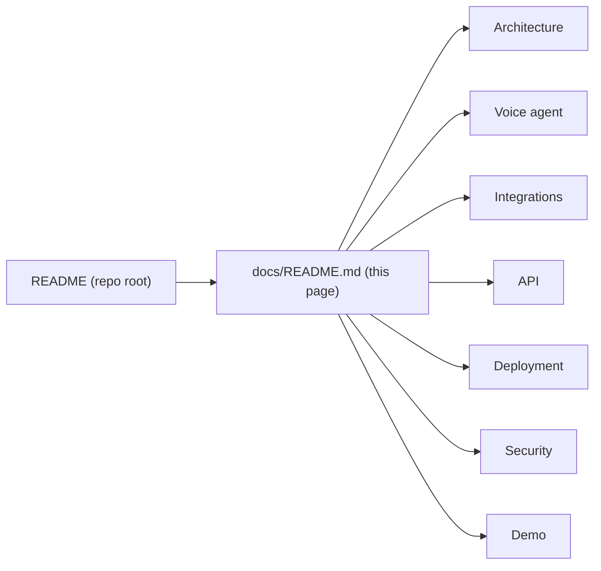

# LifeLoop documentation

**Your life-event case, coordinated.** LifeLoop is a working prototype by Team Symphony for the
"Ignyte × ElevenLabs Voice Agent Challenge" (Track 2 Government Services, use case 7: Life-Event Service
Orchestration). A voice agent runs the post-birth document chain for expatriate parents in Dubai: one call opens
one case, and LifeLoop coordinates six UAE entities instead of the family walking the chain alone.

Three rules run through every page of this documentation:

- **LifeLoop never invents government status.** A step is "cleared" only when the authority's adapter says so.
- **Human approval is required before release.** The agent prepares filings; an Amer officer releases each one; the
  authority's own officer makes every determination.
- **The consulate is parent-reported.** It has no API, no SLA and no status feed, so LifeLoop asks and records; it
  never claims.

> Every government integration in this repository is a **DEMO / MOCK** adapter with a realistic request/response
> contract. No real UAE government system is connected. See [Government adapters](integrations/government-adapters.md).

## Map

### Start here

| If you want to... | Read |
|---|---|
| Run the whole stack in Docker | [Docker deployment](deployment/docker.md) |
| Develop locally with hot reload | [Local development](deployment/local-development.md) |
| Give a 5-10 minute demo | [Demo script](demo/demo-script.md) |
| Evaluate against the judging criteria | [Evaluator walkthrough](demo/evaluator-walkthrough.md) |
| Understand the system in ten minutes | [Architecture overview](architecture/overview.md) |
| Report a vulnerability | [SECURITY.md](../SECURITY.md) |

### Architecture

| Page | What it covers |
|---|---|
| [Overview](architecture/overview.md) | Components, principles, repository layout, frontend routes |
| [System architecture](architecture/system-architecture.md) | The three Idea Canvas zones, every arrow labelled, personal-data boundaries marked |
| [Life-Event Graph](architecture/life-event-graph.md) | The six nodes, node states, the transition table, emirate routing, SLAs and their sources |
| [Event-driven architecture](architecture/event-driven-architecture.md) | Event catalogue, Kafka topics, transactional outbox, relay, consumers, dead-letter, Kafka-down fallback |
| [Data flow](architecture/data-flow.md) | Call-to-case flow, post-call webhook path, officer path, what personal data crosses which boundary |
| [Frontend](architecture/frontend.md) | Light and dark themes, the motion system, boneyard skeleton screens, responsive layout |

### Voice agent

| Page | What it covers |
|---|---|
| [Agent overview](agent/overview.md) | How the agent is built: one agent, three sub-agents, scoped tools, two transports |
| [Call flow](agent/call-flow.md) | Canvas box I steps 1-5 mapped to code |
| [Sub-agents](agent/sub-agents.md) | Router, Intake, Status, Exception; the LangGraph conversation graph; the ElevenLabs workflow config |
| [Tools](agent/tools.md) | Every server tool: arguments, authorisation, verification requirement. There is no approve tool. |
| [Guardrails](agent/guardrails.md) | Each canvas box K row: mechanism, code path, test |
| [Multilingual](agent/multilingual.md) | English, Arabic (MSA + Gulf), Hindi, Urdu, Malayalam, Tagalog; translated phrasebook; RTL; language presets |
| [Agent Testing](agent/testing.md) | The 10 guardrail scenarios, `make agent-test`, ElevenLabs Agent Testing sync, the pytest suite |

### Integrations

| Page | What it covers |
|---|---|
| [ElevenLabs](integrations/elevenlabs.md) | Agents Platform, workflows, Eleven v3, Scribe v2, KB + RAG, server tools, post-call webhook, agent sync |
| [Telephony](integrations/telephony.md) | The life-event phone line (conversation-initiation webhook), callbacks (simulated or ElevenLabs + Twilio), SMS fallback, known gaps |
| [Government adapters](integrations/government-adapters.md) | The integration contract, each mock authority, failure injection, the consulate |
| [Kafka](integrations/kafka.md) | Topics, partitioning, producer and consumer settings, in-memory fallback |
| [Redis](integrations/redis.md) | What is cached, key names, TTLs, memory fallback |
| [Neo4j](integrations/neo4j.md) | The optional graph projection, impact and bottleneck queries, PostgreSQL fallback |
| [Langfuse](integrations/langfuse.md) | Tracing, redaction, the mask hook, local fallback |

### API, deployment, security, demo

| Page | What it covers |
|---|---|
| [API overview](api/overview.md) | Every endpoint group with method, path, purpose and auth; error envelope; SSE |
| [Docker](deployment/docker.md) | Compose services, ports, health checks, startup switches, Make targets |
| [Local development](deployment/local-development.md) | uv, npm, `make dev`, Gmail credential, tests, Windows and PowerShell equivalents, troubleshooting |
| [Production](deployment/production.md) | What would change before a real pilot |
| [Threat model](security/threat-model.md) | Assets, actors, trust boundaries, STRIDE table |
| [PII handling](security/pii-handling.md) | What is stored, hashed, redacted and never stored |
| [Incident response](security/incident-response.md) | Prototype runbook: detect, contain, recover, disclose |
| [Demo script](demo/demo-script.md) | A timed evaluator demo |
| [Evaluator walkthrough](demo/evaluator-walkthrough.md) | What to look at for each judging criterion |

## Source of truth

The design follows the submitted Idea Canvas (Stage 1). Box letters (B, C, D ... Q) are used throughout these
pages so a reader can cross-check a claim against the canvas. Where the code differs from the canvas wording, the
page says so.

| Canvas box | Where it shows up |
|---|---|
| C, D (problem, baseline 6 / 7 / 6) | [README](../README.md), [Analytics](api/overview.md#officer-dashboard) |
| H (workflow today, SLAs) | [Life-Event Graph](architecture/life-event-graph.md) |
| I (call flow) | [Call flow](agent/call-flow.md) |
| J (ElevenLabs components) | [ElevenLabs](integrations/elevenlabs.md) |
| K (guardrails) | [Guardrails](agent/guardrails.md) |
| L (architecture) | [System architecture](architecture/system-architecture.md) |
| M (targets 1 / 2 / 1) | [Evaluator walkthrough](demo/evaluator-walkthrough.md) |
| N (risks) | [Threat model](security/threat-model.md), [Government adapters](integrations/government-adapters.md) |
| O (working by 14 October) | [Evaluator walkthrough](demo/evaluator-walkthrough.md) |

Back to the [repository README](../README.md).
