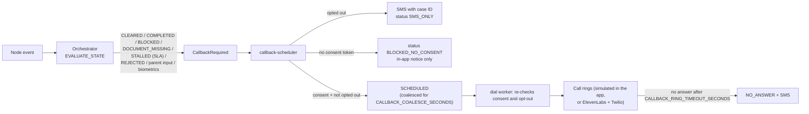

# Call flow

Idea Canvas box I describes one call, start to finish, in five steps. This page maps each step to the code that
implements it, for both the ElevenLabs transport and the simulated channel.

| Step | Canvas text | Implemented by |
|---|---|---|
| 1 | AI agent from Dubai's life-event service; call is recorded. Continue in English or Arabic? | Fixed disclosure, transcript turn 1 |
| 2 | Confirms birth, captures child's name, parents' Emirates IDs, nationality; records consent to call back. | Intake sub-agent, `create_case` |
| 3 | Builds the six-entity task graph, states what it will file and what parents must attend. | `GraphService.build`, plan explanation |
| 4 | Files permitted requests, then calls back on each state change: cleared, blocked, or document missing. | Orchestrator, human gate, adapters, callback engine |
| 5 (H) | Consulate stall, disputed record, or distress: warm-transfers to Amer officer with the case. | Exception sub-agent, `request_human_transfer`, escalations |

## Step 1: the opening disclosure

> "Hello, this is LifeLoop, an AI agent for Dubai's life-event service. This call is recorded. Would you like to
> continue in English or Arabic?"

- Text: key `disclosure` in [`i18n.py`](../../backend/app/core/i18n.py) and in each language module under
  [`translations/`](../../backend/app/core/translations/); the callback variant `disclosure_callback` adds "calling
  about case {ref}".
- Web console: `CallService.start` writes the disclosure as transcript turn 1 with `is_disclosure = true` and sets
  `disclosure_at` **before** any other processing ([`call_service.py`](../../backend/app/services/call_service.py)).
- Phone call to the life-event number: `CallService.inbound_phone` (the ElevenLabs conversation-initiation webhook)
  does the same and returns the disclosure as the conversation's `first_message`
  ([Telephony](../integrations/telephony.md#inbound-calls-to-the-life-event-number)).
- Callback: `CallService.answer` does the same with the callback disclosure.
- ElevenLabs: the agent's `first_message` is the disclosure, and each non-English language preset carries the
  disclosure in that language ([`agent.py`](../../backend/app/integrations/elevenlabs/agent.py)). The session the
  browser opens is also given the disclosure as `first_message`.
- Verified after the call: the post-call consumer audits `DisclosureMissing` if the first agent turn is not the
  disclosure. Agent Testing asserts it every release ([testing](testing.md)).

The LANGUAGE node handles the reply ("Arabic please", "English") and confirms the language.

## Step 2: intake and consent

The Intake sub-agent captures each field once, in this order (`INTAKE_STEPS` in
[`graph.py`](../../backend/app/agents/dialog/graph.py)):

1. Confirm the birth
2. Date of birth
3. Child's full name (as it should appear on the birth certificate)
4. Emirate
5. Hospital
6. Father's name, then father's Emirates ID ("I'll record it securely and I won't read it back")
7. Mother's name, then mother's Emirates ID
8. Child's nationality
9. Is the marriage certificate attested (home country, UAE embassy, MOFA)? If not, it is marked missing and the
   birth certificate step waits for it (canvas box G)
10. Consent to file (if declined: no case is opened and nothing is shared)
11. Consent to call back (if declined: updates by app and SMS only)

Opportunistic slot filling means a sentence such as "my daughter was born yesterday at Latifa Hospital in Dubai"
fills date, hospital and emirate at once. Emirates IDs are validated (15 digits starting with 784), held in process memory
only (never Redis) under `intake:eid:<call id>` for at most 30 minutes, never written into the agent state or transcript, and deleted
as soon as `create_case` hashes them.

`create_case` then calls `CaseService.create_from_intake`
([`case_service.py`](../../backend/app/services/case_service.py)), which:

- refuses without data-processing and service-filing consent (`consent_required`);
- for the **web** intake only, requires a confirmed email address; voice callers are identified by the signed-in
  session (web console) or by phone and verification (life-event number);
- is idempotent per resident, date of birth and child name (a repeated intake returns the same case);
- assigns the case to the emirate's Amer service centre and its least-loaded officer;
- stores Emirates IDs as keyed hash + last four digits;
- records the Life-Event Passport write log;
- captures `DATA_PROCESSING`, `SERVICE_FILING` and, if agreed, `CALLBACK` consent (the callback consent carries
  the `cst_…` token the callback engine requires).

## Step 3: the six-entity graph and the plan

`GraphService.build` creates the six nodes and their edges and emits `IntakeCompleted` ("Six-entity task graph
built"). The agent then says:

- the case reference and the six services;
- that LifeLoop prepares and files five of them and an Amer officer releases every submission;
- that the parent attends two things: the consulate appointment and ICP biometrics;
- that the consulate has no status feed, so LifeLoop will ask;
- what happens right now (the birth certificate is prepared for an officer, or waits for the attested marriage
  certificate);
- the legal deadline date and days remaining.

## Step 4: file, then call back on each state change

- "Files permitted requests" means: the orchestrator prepares the filing, an Amer officer releases it, and only then
  does the adapter submit ([human gate](guardrails.md#human-approval-point)).
- Several updates within the coalescing window share one call; the script is composed from every reason
  (`CallbackService.compose` in [`callback_service.py`](../../backend/app/services/callback_service.py)).
- On answer, the callback disclosure is read, the caller verifies, and the agent reads the update. If the next step
  is the consulate, it asks for the milestone.

## Step 5 (H): warm transfer to an Amer officer

The Exception sub-agent runs **first on every turn** (the EXCEPTION node in the conversation graph), so these
signals win over any other intent:

| Trigger | Escalation reason | Code |
|---|---|---|
| "Stop calling" (any language) | none: opt-out, SMS-only | `cancel_callbacks` |
| Distress | `DISTRESS` | `request_human_transfer` |
| A question about an approval decision | `APPROVAL_QUESTION` | `request_human_transfer` |
| A disputed record (during Status) | `DISPUTED_RECORD` | `request_human_transfer` |
| Asking for a person | `RESIDENT_REQUEST` | `request_human_transfer` |
| Two failed verifications on a call | `TWO_FAILED_VERIFICATIONS` | `VerificationService` |
| Parent reports the consulate is not progressing | `CONSULATE_STALL` | `ConsulateService` |
| No consulate milestone for 56 days | `CONSULATE_STALL` | SLA watchdog |
| A node past its SLA | `SLA_STALL` | Orchestrator |
| Authority rejection | `ENTITY_REJECTION` | Orchestrator |

`EscalationService.open` assigns the case's officer (or the first active officer of the service centre), marks a
live call `TRANSFERRED` and records `CallTransferred` when `warm_transfer` is set, notifies the officer, and records
`HumanEscalationRequired`. The agent says: "I'm transferring you now to {officer}, an officer at {org}, with your case
so you won't have to repeat anything." The officer receives the case, the transcript and the reason in
`/officer/escalations`. The transfer ends the agent's part of the call; a live audio bridge to the officer is not part
of this prototype.

## Related

- [Sub-agents](sub-agents.md)
- [Tools](tools.md)
- [Guardrails](guardrails.md)
- [Telephony](../integrations/telephony.md)

[Documentation index](../README.md)
