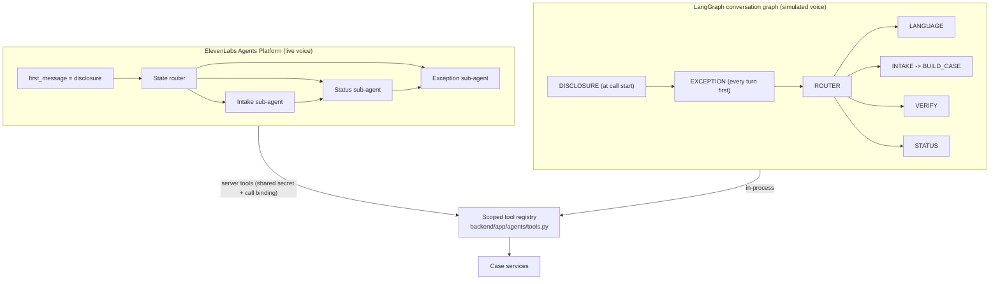

# Voice agent overview

LifeLoop's agent is one multilingual voice agent with a state router and three sub-agents (Intake, Status,
Exception). It runs the post-birth document chain for expatriate parents: it reads a fixed disclosure, captures the
family's details once, explains the six-step plan, answers status questions from tool results only, records
parent-reported consulate milestones, honours "stop calling" at any turn, and hands over to a named Amer officer
when a person is needed.

What the agent is **not** allowed to do is as important as what it does:

| The agent never | Enforced by |
|---|---|
| Skips or shortens the disclosure | Disclosure written as transcript turn 1 before anything else; ElevenLabs `first_message`; Agent Testing |
| States, guesses or implies a government status | Status comes only from `get_case_status` / `get_entity_status`; guardrail `INVENTED_APPROVAL` |
| Claims a consulate status | Consulate is parent-reported only; guardrail `INVENTED_CONSULATE_STATUS` |
| Quotes a fee or fine that is not in the knowledge base | `get_knowledge_document` returns only sourced fees; guardrail `UNSOURCED_FEE` |
| Reads an Emirates ID aloud, or asks for one on a callback | Prompt rule 5; transcript redaction; guardrail `EMIRATES_ID_READ_ALOUD` |
| Approves, releases or rejects anything | There is no such tool; guardrail `APPROVAL_BYPASS` |
| Calls without consent, or after "stop calling" | Callback engine checks the consent token and opt-out at schedule and dial time |

Details: [Guardrails](guardrails.md).

## How it is built

| Part | Code | Notes |
|---|---|---|
| Prompts | [`prompts.py`](../../backend/app/agents/prompts.py) | System prompt with ten non-negotiable rules, plus Intake, Status and Exception prompts |
| ElevenLabs agent definition | [`integrations/elevenlabs/agent.py`](../../backend/app/integrations/elevenlabs/agent.py) | Built from code (`build_agent_config`), synced with `POST /api/v1/agent/sync` |
| Conversation graph | [`agents/dialog/graph.py`](../../backend/app/agents/dialog/graph.py) | Simulated channel; mirrors the ElevenLabs workflow |
| NLU (simulated channel) | [`agents/dialog/nlu.py`](../../backend/app/agents/dialog/nlu.py) | Deterministic, multilingual lexicon; when unsure it asks rather than guesses |
| Tools | [`agents/tools.py`](../../backend/app/agents/tools.py) | 18 scoped tools, no approval tool ([Tools](tools.md)) |
| Guardrail evaluator | [`agents/guardrails.py`](../../backend/app/agents/guardrails.py) | Ten rules checked on transcripts and callback logs |
| Agent Testing | [`agents/testing/scenarios.py`](../../backend/app/agents/testing/scenarios.py) | Ten scenarios ([Agent Testing](testing.md)) |
| Phrasebook | [`core/i18n.py`](../../backend/app/core/i18n.py) | Every fixed utterance (disclosure, plan, callbacks, SMS) by key, English master |
| Calls | [`services/call_service.py`](../../backend/app/services/call_service.py) | Start, answer, turn, end; disclosure first; transcripts; post-call processing |

## Two transports

| | ElevenLabs | Simulated |
|---|---|---|
| Selected when | `ELEVENLABS_API_KEY` and `ELEVENLABS_AGENT_ID` are set and reachable | No credentials, ElevenLabs unreachable, or the demo failure switch is on |
| Speech in / out | Scribe v2 STT, Eleven v3 TTS (in the ElevenLabs session) | Typed utterances in the web console; optional `/agent/stt` and `/agent/tts` when a key and voice are configured |
| Understanding | The agent's LLM and the workflow router | The deterministic NLU |
| Tools | Server-tool webhooks to `POST /api/v1/agent/tools/{tool_name}` | Same registry, called in-process |
| Transcript | Streamed by the browser for the live console; the post-call webhook is authoritative | Written turn by turn, redacted |
| Guardrails | Prompt rules, tool design, Agent Testing, post-call disclosure audit | Same tools, same phrasebook, same evaluator |

When ElevenLabs is configured but `get_signed_url` fails, the call falls back to the simulated engine and the
response says why (`fallback_reason`). `GET /api/v1/agent/config` reports the active provider, the languages, the
tool catalogue and both graphs.

## Inbound calls and callbacks

- **Web console (resident-initiated)**: `POST /api/v1/agent/calls`. The resident is signed in, so the call starts
  verified (`verification_method = AUTHENTICATED_SESSION`). If the resident already has an active case, the call
  binds to it and goes to Status; otherwise it runs Intake.
- **Phone call to the life-event number**: ElevenLabs answers and calls LifeLoop's conversation-initiation webhook
  (`POST /api/v1/agent/webhooks/elevenlabs/initiation`), which matches the resident by caller ID (or creates a
  phone-only resident so a first-time caller can open a case), binds the call, records the disclosure and returns
  `lifeloop_call_id`. The call starts **unverified**: the caller can open a case, stop calls or ask for a person, but
  must verify before any case detail is read out ([Telephony](../integrations/telephony.md#inbound-calls-to-the-life-event-number)).
- **Callback (LifeLoop-initiated)**: the callback engine creates the call, then places it (in the app, or on the phone
  through ElevenLabs with `lifeloop_call_id` passed so the server tools bind). On answer, the callback disclosure is
  spoken first ("... calling about case LL-...") and the caller must verify (UAE Pass one-tap, simulated in this
  prototype, or the child's date of birth and hospital) before any case detail is shared. Case-revealing tools
  return `verification_required` until then.

## Related

- [Call flow](call-flow.md): canvas box I, step by step
- [Sub-agents](sub-agents.md)
- [Tools](tools.md)
- [ElevenLabs integration](../integrations/elevenlabs.md)

[Documentation index](../README.md)
