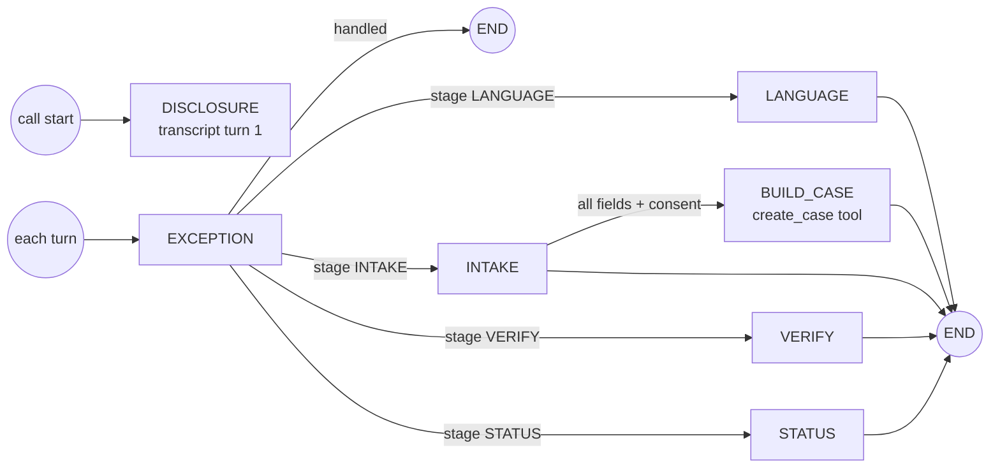

# Sub-agents

LifeLoop uses one agent with a state router and three sub-agents, as ticked in canvas box J (Agent Workflows,
Sub-agents). The same structure exists twice: as an **ElevenLabs Agent Workflow** for live voice, and as a
**LangGraph conversation graph** that runs the simulated channel with identical tools and phrasebook.

| Sub-agent | Responsibility | Tools it uses |
|---|---|---|
| Router | Picks the language, then routes by intent: new birth → Intake; existing case → Status; stop calling, distress, disputes, approval questions, failed verification → Exception. On callbacks it runs verification first | `verify_callback`, `get_case_status` |
| Intake | Confirms the birth, captures every field once, records consent, calls `create_case`, explains the six-step plan | `create_case`, `capture_consent` |
| Status | "Where are we", "what's next", "what documents", "how long", fees, timeline; asks for and records consulate milestones | `get_case_status`, `get_next_required_action`, `get_required_documents`, `get_entity_status`, `get_case_timeline`, `get_knowledge_document`, `report_consulate_milestone`, `schedule_callback`, `submit_*_request` |
| Exception | "Stop calling", distress, disputed records, approval questions, requests for a person, failed verification | `cancel_callbacks`, `request_human_transfer` |

## LangGraph conversation graph

[`backend/app/agents/dialog/graph.py`](../../backend/app/agents/dialog/graph.py)

How a turn runs (`CallService.turn` in [`call_service.py`](../../backend/app/services/call_service.py)):

1. The resident's utterance is written to the transcript (redacted).
2. The graph state is loaded from `agent_sessions` (stage, language, intake step, slots, verify step, awaiting).
3. `EXCEPTION` checks for stop-calling, distress, approval questions, disputes and requests for a person. Stop
   calling is honoured even while the agent is waiting for an Emirates ID; other signals are not interpreted while
   an ID is being spoken.
4. If not handled, the router sends the turn to the node for the current stage.
5. The reply is assembled only from phrasebook keys and tool results; the graph never composes a status itself.
6. The new state (stage, language, intake step, slots, verify step, awaiting) and the path taken are saved, and the
   turn is traced as `langgraph.conversation.turn`. Emirates IDs are never in the slots: only a `father_eid_ok` /
   `mother_eid_ok` flag, removed again at BUILD_CASE.

| Node | Behaviour |
|---|---|
| LANGUAGE | Detects the chosen language; outbound calls and unverified returning callers go to VERIFY; callers with a case go to STATUS; otherwise INTAKE. Short answers ("Arabic please") only pick a language; longer answers that mention a birth go straight into intake |
| INTAKE | Steps through `INTAKE_STEPS`; fills slots opportunistically; re-asks when unsure; ends without a case if filing consent is declined |
| BUILD_CASE | Calls `create_case`, deletes the cached Emirates IDs, reads the summary, plan, next action and deadline |
| VERIFY | UAE Pass (simulated) or two facts: child's date of birth, then hospital; two failures escalate |
| STATUS | Answers from tools: consulate milestone capture (asks whether the passport number is available, never for the number), callback request, fees (sourced only), deadline, documents, next action, consulate status (parent-reported), timeline, overall status |

`GET /api/v1/agent/sessions/{call_id}` returns the graph name, current node, sub-agent, step count and path for a
call (slots are not returned). The orchestrator graph is described in [Life-Event Graph](../architecture/life-event-graph.md#the-orchestrator).

## ElevenLabs Agent Workflow

`build_agent_config` in [`agent.py`](../../backend/app/integrations/elevenlabs/agent.py) produces the workflow
that is pushed to ElevenLabs with `POST /api/v1/agent/sync`:

| Workflow node | Type | Prompt |
|---|---|---|
| `start` | start | |
| `router` | override_agent ("State router") | Route by intent: new birth → intake; status, consulate, documents, fees → status; stop calling, distress, disputes, approval questions, failed verification → exception |
| `intake` | override_agent ("Intake sub-agent") | `INTAKE_PROMPT` |
| `status` | override_agent ("Status sub-agent") | `STATUS_PROMPT` |
| `exception` | override_agent ("Exception sub-agent") | `EXCEPTION_PROMPT` |

| Edge | Forward condition (LLM-evaluated) |
|---|---|
| start → router | always |
| router → intake | The caller is reporting a new birth and has no case yet |
| router → status | The caller asks about an existing case |
| router → exception | Stop calling, distress, dispute, approval question, or verification failure |
| intake → status | `create_case` succeeded |
| status → exception | Stop calling, distress, dispute or approval question |

Every sub-agent inherits the system prompt and its ten non-negotiable rules from
[`prompts.py`](../../backend/app/agents/prompts.py): disclosure first, facts only from tools, never claim a
consulate status, sourced fees only, never read an Emirates ID, no approvals, stop calling honoured, transfer on
distress or disputes, verify before sharing on callbacks, short and plain answers. Temperature is 0.2.

The workflow field names follow the public ElevenLabs Agents API at the time of writing. Confirm them against the
current ElevenLabs API reference before syncing to a production workspace (see
[ElevenLabs](../integrations/elevenlabs.md#agent-sync)).

## Related

- [Agent overview](overview.md)
- [Call flow](call-flow.md)
- [Tools](tools.md)
- [Multilingual](multilingual.md)

[Documentation index](../README.md)
