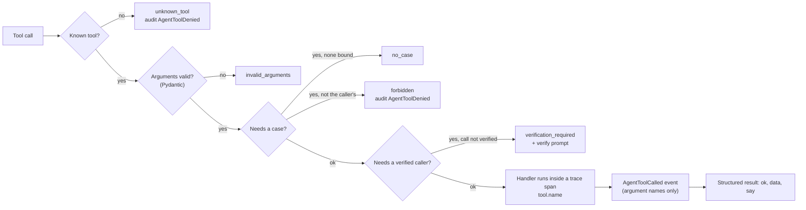

# Agent tools

Scoped tools are the **only** way the voice agent (ElevenLabs or the simulated engine) touches the system
([`backend/app/agents/tools.py`](../../backend/app/agents/tools.py)). Canvas box L: "one scoped tool per entity,
signed calls to the orchestrator".

**There is deliberately no approve, release or reject tool.** Those decisions belong to officers, through the
officer API and `ApprovalService`. An attempt to call one returns `unknown_tool` and is audited as
`AgentToolDenied` (Agent Testing scenario `approval-bypass` proves this on the live registry).

## What every tool call goes through



1. **Authentication (ElevenLabs only)**: `POST /api/v1/agent/tools/{tool_name}` requires the header
   `X-LifeLoop-Tool-Secret` to equal `VOICE_TOOL_SECRET` (constant-time comparison).
2. **Call binding**: the body carries `lifeloop_call_id`, injected by ElevenLabs from a dynamic variable that
   LifeLoop issued (web console session, conversation-initiation webhook for calls to the life-event number, or the
   outbound callback). The call must exist, be `ACTIVE` or `RINGING`, and belong to a user; the tool then acts as that
   resident only.
3. **Validation**: arguments are validated by the tool's Pydantic model.
4. **Authorisation**: tools that need a case act only on the case bound to the call, and only if the case's resident
   is the caller. Staff cannot invoke tools outside a call.
5. **Verification**: case-revealing tools require a verified caller. Web-console calls from a signed-in resident
   start verified (`AUTHENTICATED_SESSION`); callbacks and calls to the life-event number start unverified.
6. **Observability**: each call is a `tool.<name>` span (inputs redacted), a `lifeloop_agent_tool_calls_total`
   metric, a structured log line and an `AgentToolCalled` event that records only the argument **names**.

## Tool catalogue

"Case" means the tool needs a case bound to the call. "Verified" means the caller must be verified (callbacks and phone calls start unverified).

| Tool | Arguments | Case | Verified | What it does |
|---|---|---|---|---|
| `get_case_status` | none | yes | yes | Every node's state, status line, source and entity; progress; deadline; and the rule: only describe states listed, `CLEARED`/`COMPLETED` from `GOVERNMENT_MOCK` are the authority's (mock) confirmations, `PARENT_REPORTED` is what the parent said |
| `get_next_required_action` | none | yes | yes | The single next action and its owner (parent, officer, authority), outstanding documents |
| `get_required_documents` | `node_key?` | yes | yes | Documents still needed, optionally for one node |
| `create_case` | `child_full_name_en`, `child_date_of_birth`, `place_of_birth`, `emirate` (default DUBAI), `child_nationality`, `father_full_name?`, `mother_full_name?`, `father_emirates_id?`, `mother_emirates_id?`, `marriage_certificate_attested?`, `consent_callback`, `consent_service_filing`, `consent_data_processing`, `language` | no | no | Creates the case once intake is confirmed. Emirates IDs are hashed on arrival; never repeat them. Idempotent |
| `capture_consent` | `consent_type`: CALLBACK, DATA_PROCESSING or SERVICE_FILING | yes | no | Records consent with timestamp and call reference. CALLBACK issues the token the callback engine needs |
| `verify_callback` | `method`: UAE_PASS or KNOWLEDGE_FACTS; `date_of_birth?`, `hospital?` | yes | no | UAE Pass one-tap (simulated) or the child's date of birth and hospital. Never asks for ID numbers. Two failures escalate |
| `submit_birth_certificate_request` | none | yes | yes | Prepares the birth certificate filing for officer release. Does not file it |
| `submit_mofa_request` | none | yes | yes | Prepares the MOFA attestation filing for officer release |
| `submit_visa_request` | none | yes | yes | Prepares the residence visa filing for officer release |
| `submit_emirates_id_request` | none | yes | yes | Prepares the Emirates ID filing for officer release |
| `submit_insurance_request` | none | yes | yes | Prepares the insurance endorsement for officer release |
| `get_entity_status` | `node_key`: one of the six node keys | yes | yes | The authority's last confirmed status for one node, its external reference and `confirmed_by_authority`. For the consulate: only the last parent-reported milestone |
| `report_consulate_milestone` | `milestone`: APPOINTMENT_BOOKED, APPLICATION_SUBMITTED, PASSPORT_ISSUED or DELAYED; `passport_number_present`; `appointment_date?`; `notes?` | yes | yes | Records what the **parent** reports, as `PARENT_REPORTED`. Never claim it yourself |
| `schedule_callback` | none | yes | no | Requests a status callback; consent and opt-out are enforced |
| `cancel_callbacks` | `stop_calling` (default true) | yes | no | "Stop calling": opt out, cancel pending callbacks, switch the case to SMS-only. Always allowed |
| `request_human_transfer` | `reason`: DISTRESS, APPROVAL_QUESTION, DISPUTED_RECORD or RESIDENT_REQUEST; `summary` | yes | no | Warm transfer to the case's Amer officer |
| `get_case_timeline` | `limit` (1-20, default 5) | yes | yes | The most recent case events with their source |
| `get_knowledge_document` | `query` (2-200 chars) | no | no | Searches the read-only knowledge base; returns documents, any sourced `fee`, and the rule "quote a fee only if it appears here, with its source" |

Notes:

- The five `submit_*_request` tools never file anything. When the node is ready and nothing is missing they park it
  for officer release; when it is still `PENDING` they say which step it is waiting for. The reply always includes
  "An Amer officer releases every submission; I can't approve or send it myself."
- `get_entity_status` returns "I don't have a confirmed update from the authority yet" while a node is `SUBMITTED`
  or `PROCESSING`.
- `cancel_callbacks`, `request_human_transfer`, `verify_callback`, `capture_consent` and `schedule_callback` do not
  require verification, so a caller can always stop calls, ask for a person or verify.

## Tool definitions as ElevenLabs sees them

`build_agent_config` turns each `ToolSpec` into an ElevenLabs webhook tool
([`agent.py`](../../backend/app/integrations/elevenlabs/agent.py)):

```json
{
  "type": "webhook",
  "name": "get_case_status",
  "description": "Where the case stands: every node's state and its source. Never improvise a status.",
  "api_schema": {
    "url": "<PUBLIC_BASE_URL>/api/v1/agent/tools/get_case_status",
    "method": "POST",
    "request_headers": {"X-LifeLoop-Tool-Secret": "<VOICE_TOOL_SECRET>"},
    "request_body_schema": {
      "type": "object",
      "required": ["lifeloop_call_id"],
      "properties": {
        "lifeloop_call_id": {"type": "string", "dynamic_variable": "lifeloop_call_id"},
        "arguments": {"type": "object", "properties": {}}
      }
    }
  }
}
```

`GET /api/v1/agent/config` returns the same catalogue with JSON Schemas (`ToolRegistry.catalog()`), including
`requires_case` and `requires_verified_caller` for each tool.

## Related

- [Guardrails](guardrails.md)
- [Sub-agents](sub-agents.md)
- [ElevenLabs](../integrations/elevenlabs.md#server-tools)
- [API overview](../api/overview.md#agent)

[Documentation index](../README.md)
