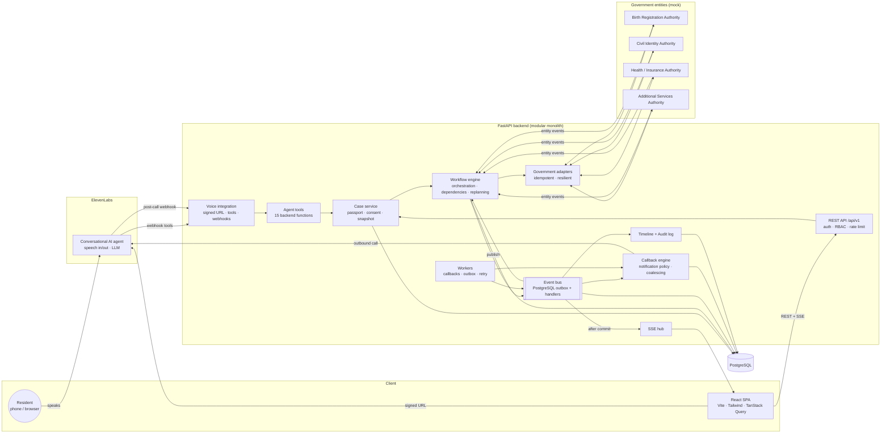

# Architecture

LIFELOOP is a **modular monolith**: one FastAPI application containing the workflow engine, event system, voice integration, government adapters and callback engine, backed by PostgreSQL, with a React SPA in front. Module boundaries follow the eventual service split, so any block below can move to its own deployment without touching the domain layer.

## Components

| Component | Responsibility | Code |
|---|---|---|
| **Frontend** | Landing, dashboard, life-event detail (graph, timeline, passport), voice center, callbacks, entity ops, demo control. Server state via TanStack Query, live via SSE. | `frontend/src` |
| **FastAPI** | Versioned REST API, JWT auth, RBAC, validation, structured logging, OpenAPI. Routes contain no business logic. | `backend/app/api` |
| **Service layer** | All domain logic, wired by a per-request `ServiceContainer`. | `backend/app/services` |
| **Workflow engine** | Instantiates workflow definitions as tasks, evaluates dependencies, submits executable tasks, applies entity events, completes cases. | `orchestration_service`, `dependency_service`, `state_machine` |
| **Replanning** | Exception ladder for delays, rejections, missing documents, failures. | `replanning_service`, `agents/exception_agent` |
| **Event bus** | `EventBus` port + `PostgresEventBus`. Persists every event (audit + outbox), dispatches handlers, idempotent by key. | `backend/app/events` |
| **Callback engine** | Notification policy, coalescing, provider-agnostic call placement, completion. | `callback_service`, `integrations/elevenlabs/callbacks` |
| **ElevenLabs** | Client, agent definition/sync, session lifecycle, outbound calls, webhooks. | `integrations/elevenlabs` |
| **Government adapters** | `GovernmentAdapter` contract and four mock authorities with their own system of record. | `integrations/government` |
| **Timeline** | Resident-facing projection of persisted events. | `timeline_service` |
| **Audit log** | The `events` table: actor, actor type, before/after state, source, metadata. | `models/event.py` |

## Runtime flow of one event

1. An authority (or the demo control center) calls `POST /events` or a simulate endpoint.
2. `ingest_entity_event` validates the transition with the state machine, updates the task and **publishes** a domain event (idempotent).
3. `commit()` drains the bus: handlers write the timeline, unlock and start dependants, replan on exceptions, decide on a callback, and finally complete the case.
4. The transaction commits; only then are SSE notifications sent, so the UI always refetches committed state.
5. The callback worker places due calls through the configured provider (ElevenLabs telephony or the simulated channel).

See [workflow-engine.md](workflow-engine.md), [event-model.md](event-model.md) and [elevenlabs.md](elevenlabs.md) for detail.
