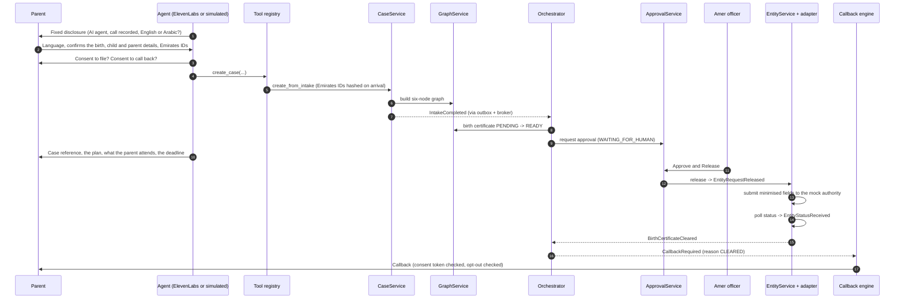
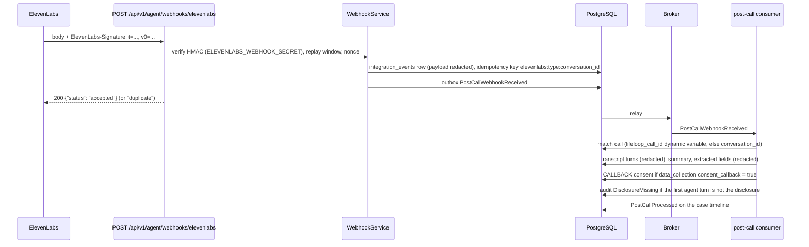
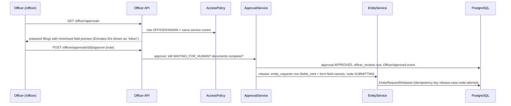

# Data flow

This page follows the data: from the first call to a filed request, from an ElevenLabs post-call webhook into the
case, and from an officer's decision back to the parent. At each boundary it says which personal data crosses and
what is minimised. The field-level rules are in [PII handling](../security/pii-handling.md).

## 1. Call to case (conceptual flow)

What is captured once on call one (the Life-Event Passport write log, `cases.passport`): child name (English and
Arabic), date of birth, sex, place of birth, nationality; each parent's name, nationality and Emirates ID; emirate;
language; whether the marriage certificate is attested. Each field records `captured_at`, `source` (VOICE or WEB)
and the call session id. If a field is collected again later, `re_entry_count` increments: that is the canvas box M
"captured once" KPI ([`case_service.py`](../../backend/app/services/case_service.py)).

### Calls to the life-event number

A parent can also call the life-event number directly. ElevenLabs answers and, before the conversation starts, calls
LifeLoop's conversation-initiation webhook with the caller ID. LifeLoop matches the resident by the last nine digits
of the caller ID (or creates a phone-only resident), binds the call to the resident's active case, records the
disclosure as transcript turn 1 and returns `lifeloop_call_id`. From then on the flow above is the same, except that
the caller starts **unverified**: opening a case needs no verification, but reading out an existing case does
([Telephony](../integrations/telephony.md#inbound-calls-to-the-life-event-number)).

## 2. Post-call webhook path

When ElevenLabs runs the conversation, its post-call webhook is the authoritative record of the call.

The handler only records and enqueues; processing happens in the consumer, so a slow database never makes
ElevenLabs retry. A retried webhook with the same conversation id is acknowledged as a duplicate and not re-run.

How the graph advances in this build: during the call, the agent's server tools (`create_case`,
`report_consulate_milestone`, `cancel_callbacks`, ...) write to the case immediately, and those writes emit the
events that drive the orchestrator. The post-call webhook writes the call's outcome (transcript, consent evidence,
extracted fields) and closes the callback. The next entity request is then prepared by the orchestrator and released
by an officer; no filing is released by the webhook alone.

## 3. Officer path

Rejecting requires a reason and moves the node to BLOCKED; "Request documents" marks the documents missing and moves
the node to DOCUMENT_MISSING. Every decision writes an `officer_reviews` row, a timeline event and an audit record
with the officer as the actor.

## Personal data at each boundary

| Boundary | Personal data that crosses | What is minimised or withheld |
|---|---|---|
| Parent → channel (Twilio / web) ● | Voice; child's name; parents' names and Emirates IDs; nationality; hospital | The agent says it will not read Emirates IDs back and never does (guardrail `EMIRATES_ID_READ_ALOUD`) |
| ElevenLabs → initiation webhook ● | Caller ID, called number, Twilio call SID | Used only to bind the call; the called number is stored masked; a new phone-only resident gets a masked display name |
| Channel → ElevenLabs ● | Audio and its transcription | LifeLoop does not store audio. Audio and transcripts held by ElevenLabs follow the ElevenLabs workspace's retention settings |
| ElevenLabs → LifeLoop tools ● | Only the arguments of the tool being called, plus `lifeloop_call_id` | Tool arguments are validated by Pydantic; the `AgentToolCalled` event stores argument **names**, not values; trace inputs are redacted |
| Simulated channel → LifeLoop ● | Typed or transcribed utterances | Each transcript turn passes through `redact_text` before storage: Emirates IDs become `[EMIRATES_ID]`, passport-like numbers `[PASSPORT]`, phone numbers `[PHONE]` |
| Intake → case store ● | Names, date and place of birth, nationality, Emirates IDs | Emirates IDs are stored only as a keyed hash (key `PII_HASH_KEY`) plus the last four digits; during voice intake they wait in process memory only (never Redis) for at most 30 minutes until `create_case` hashes them, then the key is deleted |
| ElevenLabs post-call → LifeLoop ● | Transcript, summary, data-collection results | Payload redacted with `redact_value` before it is stored in `integration_events`; transcript turns redacted; extracted fields redacted |
| LifeLoop → authority adapter ● | Only the node's `form_fields` | Emirates IDs leave only as `eidtok_<16 hex>` tokens derived from the keyed hash; passport numbers never leave (only `child.passport_present`); any field outside the form is refused (`FieldsNotAllowed`) |
| Parent → consulate node ● | Milestone, appointment date, optional notes | Passport number is never stored, only "available: yes/no"; notes are redacted |
| LifeLoop → parent (callback, SMS, email) ● | Case reference, node titles, reasons | No Emirates ID, passport number or other identifier is spoken or sent; case details are shared on a callback only after verification |
| LifeLoop → Neo4j | Case id, reference, status, emirate; node id, key, state, entity | No names, dates of birth or identifiers |
| LifeLoop → Langfuse ● | Span inputs and outputs | Passed through `redact_value` and the Langfuse `mask` hook before leaving the process |
| LifeLoop → logs | Structured events | structlog `_redact` processor, then Logifyx masking; emails and phones masked |
| Officer dashboard | Case detail for their own service centre | Officers see Emirates IDs as "ending NNNN"; residents see `784-****-*******-N`; the resident's phone is masked |

## Related

- [System architecture](system-architecture.md): the ● boundaries in context
- [PII handling](../security/pii-handling.md)
- [ElevenLabs](../integrations/elevenlabs.md): webhook signature details
- [Government adapters](../integrations/government-adapters.md): `allowed_fields`

[Documentation index](../README.md)
