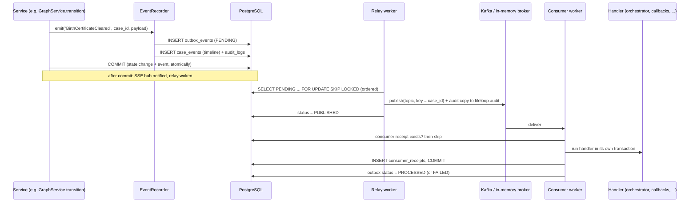

# Event-driven architecture

Every state change in LifeLoop produces a domain event. Events are written to a **transactional outbox** in the
same PostgreSQL transaction as the change that caused them, relayed to **Kafka** after commit, and consumed by
**named, idempotent consumers**. The same pipeline runs on an in-memory broker when Kafka is not available.

## The write path

Key properties:

- **No event without its state, no state without its event.** The outbox row, the timeline entry and the audit
  record are written by one call ([`recorder.py`](../../backend/app/events/recorder.py)) in the caller's
  transaction. Nothing is published before commit, so a rollback can never leak an event.
- **Payloads are redacted** with `redact_value` before they are stored ([PII handling](../security/pii-handling.md)).
- **Idempotency keys** on `emit` (for example `cbreq:<trigger event id>`, `case-completed:<case id>`,
  `release:<case>:<node>:<attempt>`, `postcall-processed:<integration event id>`) make a repeated emit a no-op.
- **Server-Sent Events** for the UI are published from an in-process hub only after commit
  ([`stream.py`](../../backend/app/events/stream.py)), so a client that refetches always sees the new state.

## Topics

| Topic | Categories routed here | Consumers |
|---|---|---|
| `lifeloop.case.events` | `case`, `node_transition`, `officer` | `orchestrator`, `graph-projection` |
| `lifeloop.case.callbacks` | `callback` | `callback-scheduler` |
| `lifeloop.entity.requests` | `entity_request` | `entity-submitter` |
| `lifeloop.entity.status` | `entity_status` | `entity-status` |
| `lifeloop.agent.events` | `agent` | `post-call` |
| `lifeloop.notifications` | `notification` | `notifier` |
| `lifeloop.audit` | copy of every relayed event (`audit_copy: true`) | none (counted as `audited`) |

Topic names live in [`catalog.py`](../../backend/app/events/catalog.py). Messages are keyed by case id so one
case's events stay ordered within a partition.

## Event catalogue

### Case lifecycle (`lifeloop.case.events`)

| Event | Timeline | Emitted when |
|---|---|---|
| `CaseCreated` | yes | Intake creates the case |
| `IntakeCompleted` | yes | The six-node graph is built (orchestrator trigger) |
| `CaseCompleted` | yes | Every node is done (once, idempotent) |
| `CaseStatusChanged` | no | Derived case status changes |
| `ConsentCaptured` / `ConsentRevoked` | yes | A consent is recorded or withdrawn |
| `OptOutRequested` / `OptOutCompleted` / `OptInRestored` | yes | "Stop calling" and its reversal |
| `VerificationSucceeded` / `VerificationFailed` | yes | Caller verification on a call |
| `DocumentUploaded` / `DocumentVerified` | yes | Resident upload; officer check (not a government verification) |
| `ConsulateMilestoneReported` | yes | Parent-reported consulate milestone |
| `HumanEscalationRequired` / `EscalationResolved` | yes | Escalation opened (orchestrator trigger) / resolved |
| `PostCallProcessed` | yes | The post-call webhook was written to the case |

### Officer gate (`lifeloop.case.events`)

| Event | Timeline | Emitted when |
|---|---|---|
| `ApprovalRequested` | no | A filing is prepared and parked for release |
| `OfficerApproved` | yes | Approve and Release |
| `OfficerRejected` | yes | Officer did not release (reason required) |
| `OfficerRequestedDocuments` | yes | Officer asked the resident for documents |
| `CaseTransferred` | yes | Case moved to another officer |

### Node transitions (`lifeloop.case.events`)

Each transition emits one event. Where the canvas names the milestone, the event has a semantic name; otherwise a
generic `Node<State>` name is used.

| Semantic event | Node and state |
|---|---|
| `BirthCertificateSubmitted` | Birth certificate → SUBMITTED |
| `BirthCertificateCleared` | Birth certificate → CLEARED |
| `MOFAReady` | MOFA → READY |
| `MOFACompleted` | MOFA → CLEARED |
| `ConsulatePassportReported` | Consulate → COMPLETED |
| `VisaRequestCreated` | Residence visa → SUBMITTED |
| `VisaCleared` | Residence visa → CLEARED |
| `EmiratesIDReady` / `EmiratesIDCompleted` | Emirates ID → READY / COMPLETED |
| `InsuranceReady` / `InsuranceCompleted` | Insurance → READY / COMPLETED |

Generic names: `NodeReset`, `NodeReady`, `NodeAwaitingRelease`, `NodeSubmitting`, `NodeSubmitted`,
`NodeProcessing`, `NodeCleared`, `NodeCompleted`, `NodeBlocked`, `DocumentMissing`, `NodeStalled`,
`NodeWaitingForParent`, `NodeRejected`.

### Callbacks, entities, agent, notifications

| Event | Topic | Timeline | Emitted when |
|---|---|---|---|
| `CallbackRequired` | callbacks | no | The orchestrator decides the parent should hear about a change |
| `CallbackScheduled` / `CallbackDialed` / `CallbackCompleted` / `CallbackNoAnswer` | callbacks | yes | Callback lifecycle |
| `CallbackBlocked` | callbacks | yes | No consent token, or opted out (SMS sent instead) |
| `CallbacksCancelled` | callbacks | yes | Opt-out or consent withdrawal cancelled pending callbacks |
| `EntityRequestReleased` | entity.requests | no | Officer released a filing (or retried a stalled one) |
| `EntityStatusReceived` | entity.status | no | A poll or demo simulation returned a new authority status |
| `CallStarted` / `CallEnded` | agent | yes | Call lifecycle (`CallStarted` also for calls to the life-event number, via the initiation webhook) |
| `CallTransferred` | agent | yes | A live call was warm-transferred to an Amer officer (recorded with the call and escalation ids, alongside `HumanEscalationRequired`) |
| `AgentToolCalled` | agent | no | Every tool call (tool name, ok flag, argument **names** only) |
| `PostCallWebhookReceived` | agent | no | A verified ElevenLabs webhook was stored |
| `NotificationRequested` | notifications | no | An SMS or email is queued |

## Consumers

Delivery is at-least-once. The `consumer_receipts` table (unique on consumer + event id) turns that into an
exactly-once **effect**: a redelivered event finds its receipt and is acknowledged without running the handler again
([`consumers.py`](../../backend/app/events/consumers.py), [`handlers.py`](../../backend/app/events/handlers.py)).

| Consumer | Topic | Events | Effect |
|---|---|---|---|
| `orchestrator` | case.events | `IntakeCompleted`, `HumanEscalationRequired`, `CaseCompleted`, all node events | Runs the [case orchestrator](life-event-graph.md#the-orchestrator) |
| `graph-projection` | case.events | categories `node_transition`, `case` | Invalidates the case summary cache; re-projects the graph to Neo4j on node transitions and `IntakeCompleted` |
| `callback-scheduler` | case.callbacks | `CallbackRequired` | Consent and opt-out checks, coalescing, scheduling |
| `entity-submitter` | entity.requests | `EntityRequestReleased` | Files the released request with the (mock) authority |
| `entity-status` | entity.status | `EntityStatusReceived` | Applies the authority's status to the node (validated) |
| `post-call` | agent.events | `PostCallWebhookReceived` | Writes transcript, consent evidence and extracted fields to the case |
| `notifier` | notifications | `NotificationRequested` | Sends one SMS or email (idempotent: a SENT row is never re-sent) |

Each handler runs in its own database transaction with a fresh service container. The trace id of the original
request is carried on the message and re-bound in the consumer, so logs and traces join up end to end.

## Dead-letter

A handler that raises is retried `CONSUMER_MAX_ATTEMPTS` times (default 3) with a short backoff. After the last
attempt the event is **dead-lettered**: the outbox row's `error` records `<consumer>: <exception>`, its status
becomes `FAILED`, and the metric `lifeloop_events_consumed_total{outcome="dead_letter"}` increments. The stream is
not blocked. Failed rows are visible at `GET /api/v1/demo/outbox?status=FAILED` (demo mode) and in the database.
Re-driving a failed event is a manual operation in this prototype (planned: an admin re-drive endpoint).

## Workers

[`workers/runner.py`](../../backend/app/workers/runner.py) starts five loops inside the API process when
`RUN_WORKERS=true`:

| Worker | Interval | Job |
|---|---|---|
| `relay` | woken after every commit, otherwise `WORKER_POLL_SECONDS` (0.5 s) | Outbox → broker, in order |
| `consumer` | continuous | Broker → `dispatch` → handlers |
| `callbacks` | 1 s | Dial due callbacks (consent and opt-out re-checked at dial time); sweep unanswered calls after `CALLBACK_RING_TIMEOUT_SECONDS` |
| `entities` | `ENTITY_POLL_SECONDS` (20 s) | Poll open requests at the (mock) authorities |
| `sla` | `SLA_CHECK_SECONDS` (30 s) | Mark nodes past SLA as STALLED; escalate a silent consulate |

Each loop is isolated so it can later run as a separate process. Heartbeats appear in `/ready` and as
`lifeloop_worker_heartbeat_timestamp`.

`WorkerRunner.paused()` holds every loop at its next iteration, after in-flight work finishes. The demo reset
(`POST /api/v1/demo/reset`) rebuilds LL-DEMO-001 inside it: the rebuild replays the real pipeline on a backdated clock
and drives its own events, so the live relay must not pick those events up on the real clock and race the replay.
The `entities` poller re-files a request idempotently (same idempotency key, same reference) when a mock authority
reports that it has no such application, for example after its in-memory state was reset by a restart without Redis.

## When Kafka is down

| Situation | Behaviour |
|---|---|
| `KAFKA_BOOTSTRAP_SERVERS` empty | In-memory broker (`mode: in-memory`). Same contract, same consumers, single process |
| Kafka unreachable at start-up | In-memory fallback (`mode: in-memory-fallback`) with the error in `/ready`. Restart the backend to reconnect |
| Publish fails at runtime | The outbox row stays `PENDING`; `attempts` increments; it becomes available again after `min(30, 0.5 × 2^attempts)` seconds. The relay stops at the first failure so order is preserved |
| Demo "simulate Kafka failure" | `BrokerManager.simulate_failure = true` makes every publish fail. State changes still commit to PostgreSQL and appear on the timeline, but downstream effects (orchestration, callbacks, filings) wait. `/ready` shows `simulated_failure: true` and `outbox_pending` growing. Turning the switch off wakes the relay, and the backlog drains in order |

The demo switch is `POST /api/v1/demo/failures` with `{"component": "kafka", "enabled": true}` (officer or admin,
`DEMO_MODE=true`). It is the outbox pattern made visible: nothing is lost, nothing is reordered.

## Synchronous pump (tests and seed)

[`pump.py`](../../backend/app/events/pump.py) runs relay and dispatch in a loop until quiescent. Tests use it for
deterministic end-to-end flows, and the seed uses it with a private in-memory broker to build demo cases by
running the real pipeline on a backdated clock. The code path per event (relay → broker → dispatch → handler) is
the same as in production.

## Related

- [Kafka](../integrations/kafka.md): topic configuration, producer and consumer settings
- [Life-Event Graph](life-event-graph.md)
- [Data flow](data-flow.md)
- [System architecture](system-architecture.md)

[Documentation index](../README.md)
