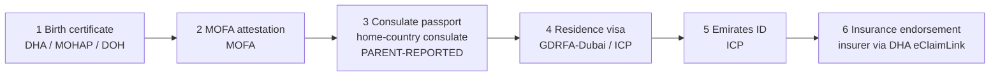
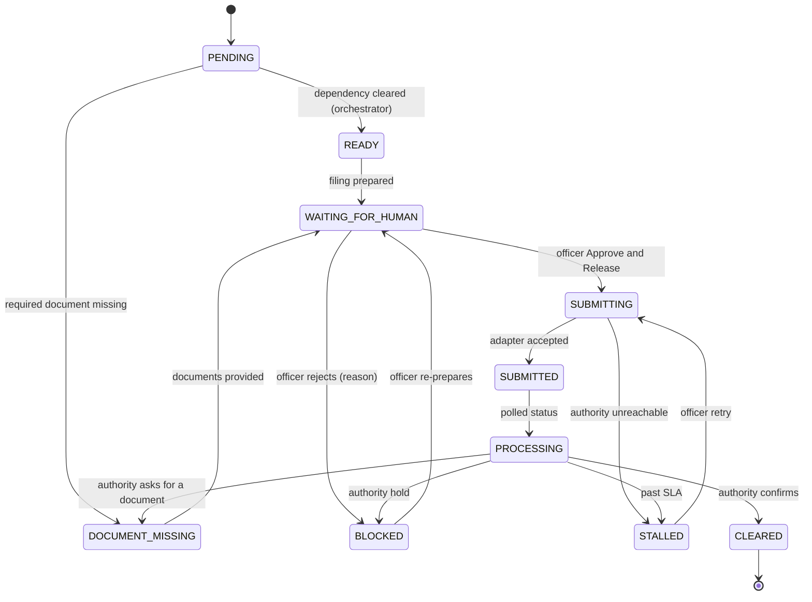
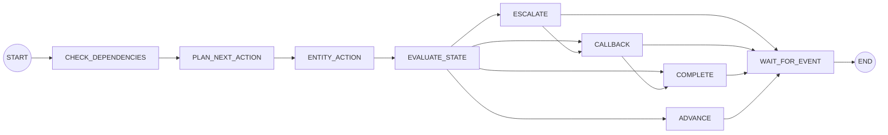

# Life-Event Graph

Every case owns one Life-Event Graph: six nodes, one per service that follows a birth, connected by dependency
edges. The template is data, not code paths ([`birth_expat.py`](../../backend/app/workflows/birth_expat.py)): edges
are a list, so parallel branches can be added later without touching the engine. Every node state change goes
through one validated state machine ([`state_machine.py`](../../backend/app/workflows/state_machine.py)) and one
service method (`GraphService.transition` in [`graph_service.py`](../../backend/app/services/graph_service.py)).

## The six nodes

| # | Node key | Type | Depends on | Officer release | Parent attends | Success state |
|---|---|---|---|---|---|---|
| 1 | `BIRTH_CERTIFICATE` | ENTITY_FILING | none | yes | no | CLEARED |
| 2 | `MOFA_ATTESTATION` | ENTITY_FILING | Birth certificate | yes | no | CLEARED |
| 3 | `CONSULATE_PASSPORT` | PARENT_REPORTED | MOFA attestation | no (nothing is filed) | yes, consulate appointment | COMPLETED |
| 4 | `RESIDENCE_VISA` | ENTITY_FILING | Consulate passport | yes | no | CLEARED |
| 5 | `EMIRATES_ID` | ENTITY_FILING | Residence visa | yes | yes, ICP biometrics | COMPLETED |
| 6 | `INSURANCE` | ENTITY_FILING | Emirates ID | yes | no | COMPLETED |

LifeLoop files five of the six. The family attends two things in person: the consulate appointment and ICP
biometrics. These are the canvas box M targets (1 entity tracked by the family, 2 in-person visits).

### Documents and form fields

| Node | Required documents | Output | Fields sent to the authority (`form_fields`) |
|---|---|---|---|
| Birth certificate | Hospital birth notification, attested marriage certificate, both parents' passports and Emirates IDs | Birth certificate | child name (en, ar), date and place of birth, sex, birth notification ref; each parent's name, nationality and Emirates ID **token** |
| MOFA attestation | Birth certificate | MOFA-attested birth certificate | birth certificate reference, child name (en) |
| Consulate passport | Attested birth certificate, both parents' passports | none (parent-reported) | none: nothing is sent |
| Residence visa | Child's passport, attested birth certificate, sponsor's residence visa, child photo | Child's residence visa | child name, date of birth, nationality, `passport_present` flag, sponsor Emirates ID **token**, birth certificate reference |
| Emirates ID | Child's passport, child's residence visa | Child's Emirates ID | visa reference, child name, date of birth |
| Insurance | Child's Emirates ID, child's residence visa | Insurance endorsement | child name, date of birth, Emirates ID application reference, sponsor name |

The adapter rejects any field outside its form (`FieldsNotAllowed`), so the Life-Event Passport is never sent
wholesale. See [Data flow](data-flow.md).

## Emirate routing

The authority for a node depends on the emirate of birth (`entity_for` in
[`birth_expat.py`](../../backend/app/workflows/birth_expat.py)):

| Node | Dubai | Abu Dhabi | Sharjah, Ajman, Umm Al Quwain, Ras Al Khaimah, Fujairah |
|---|---|---|---|
| Birth certificate | DHA (DHA Salama) | DOH | MOHAP |
| MOFA attestation | MOFA | MOFA | MOFA |
| Consulate passport | Home-country consulate | Home-country consulate | Home-country consulate |
| Residence visa | GDRFA-Dubai (via Amer) | ICP | ICP |
| Emirates ID | ICP | ICP | ICP |
| Insurance | Insurer via DHA eClaimLink | Insurer via DHA eClaimLink | Insurer via DHA eClaimLink |

The consulate node is labelled with the child's nationality, for example "Indian consulate (home country - not
a UAE entity)".

## SLAs and their sources

Every SLA and fee carries the source it came from. Anything not in a source is not shown or spoken. All SLAs below
come from the Symphony Idea Canvas (Stage 1), box H: the team's research against each entity's published process.

| Node | SLA label shown | `sla_hours` (clock starts at SUBMITTED) | Fee in LifeLoop's sources |
|---|---|---|---|
| Birth certificate | 1-5 days | 120 | none |
| MOFA attestation | 2 hours - 3 working days | 72 | AED 150 (canvas box H stage 3; confirm against the current MOFA schedule) |
| Consulate passport | No SLA - 2 to 8 weeks with no status feed | none | none (varies by country) |
| Residence visa | 3-10 days, blocked until the consulate step clears | 240 | none |
| Emirates ID | 5-15 days, card by courier | 360 | none |
| Insurance | LifeLoop service target (no published SLA in our sources) | 72 | none |

The legal deadline is `LEGAL_DEADLINE_DAYS` (120) days from the date of birth (canvas box C). The case view shows
the deadline date, days remaining and a status: `ON_TRACK`, `AT_RISK` (under 30 days), `OVERDUE` or `COMPLETE`.
The only fine the agent may quote is the canvas box C range (AED 25-100 per day), always with its source
([`01-legal-deadline.md`](../../backend/app/knowledge/01-legal-deadline.md)).

## Node states

| State | Meaning | Next action owner |
|---|---|---|
| `PENDING` | Waiting for an earlier step | SYSTEM |
| `READY` | Dependencies done; LifeLoop is preparing the filing | AGENT |
| `WAITING_FOR_HUMAN` | Prepared, awaiting officer release | OFFICER |
| `SUBMITTING` | Released; being filed with the authority | ENTITY |
| `SUBMITTED` | Accepted by the authority's (mock) API; SLA clock running | ENTITY |
| `PROCESSING` | The authority reports it is processing | ENTITY |
| `CLEARED` | The authority confirmed it (birth certificate, MOFA, visa) | none |
| `COMPLETED` | Done (consulate as parent-reported, Emirates ID, insurance) | none |
| `DOCUMENT_MISSING` | A required document is missing (at planning time or requested by the authority or an officer) | PARENT |
| `BLOCKED` | The authority put it on hold, or an officer did not release it | OFFICER |
| `STALLED` | Not cleared yet: the authority was unreachable, the SLA passed, or the parent reports no consulate progress | OFFICER |
| `WAITING_FOR_PARENT` | The parent must act (consulate milestone, ICP biometrics) | PARENT |
| `REJECTED` | The authority did not approve | OFFICER |

`CLEARED` and `COMPLETED` are the done states. Only a `CLEARED` or `COMPLETED` state whose source is
`GOVERNMENT_MOCK` counts as an authority confirmation; `PARENT_REPORTED` is what the parent told LifeLoop.

### Transition table

Every transition is checked by `assert_transition`; anything not listed raises `InvalidTransition` (HTTP 409).

| From | Allowed targets |
|---|---|
| `PENDING` | READY, WAITING_FOR_PARENT, DOCUMENT_MISSING, BLOCKED |
| `READY` | WAITING_FOR_HUMAN, WAITING_FOR_PARENT, DOCUMENT_MISSING, SUBMITTING, PENDING, BLOCKED |
| `WAITING_FOR_HUMAN` | SUBMITTING, BLOCKED, DOCUMENT_MISSING, REJECTED, READY |
| `SUBMITTING` | SUBMITTED, PROCESSING, STALLED, BLOCKED, REJECTED, DOCUMENT_MISSING |
| `SUBMITTED` | PROCESSING, CLEARED, COMPLETED, BLOCKED, DOCUMENT_MISSING, STALLED, REJECTED, WAITING_FOR_PARENT |
| `PROCESSING` | CLEARED, COMPLETED, BLOCKED, DOCUMENT_MISSING, STALLED, REJECTED, WAITING_FOR_PARENT |
| `WAITING_FOR_PARENT` | PROCESSING, COMPLETED, CLEARED, STALLED, DOCUMENT_MISSING, READY, WAITING_FOR_HUMAN, BLOCKED |
| `DOCUMENT_MISSING` | READY, WAITING_FOR_HUMAN, WAITING_FOR_PARENT, BLOCKED, SUBMITTING |
| `STALLED` | SUBMITTING, SUBMITTED, PROCESSING, WAITING_FOR_HUMAN, WAITING_FOR_PARENT, BLOCKED, CLEARED, COMPLETED, READY, DOCUMENT_MISSING, REJECTED |
| `BLOCKED` | WAITING_FOR_HUMAN, DOCUMENT_MISSING, READY, SUBMITTING, REJECTED |
| `REJECTED` | WAITING_FOR_HUMAN, READY |
| `CLEARED` | COMPLETED |
| `COMPLETED` | none (terminal) |

An authority adapter may only report: SUBMITTED, PROCESSING, CLEARED, COMPLETED, BLOCKED, DOCUMENT_MISSING,
STALLED, REJECTED, WAITING_FOR_PARENT (`ENTITY_REPORTABLE`). A status that is not a valid transition from the
node's current state is logged and ignored, never forced.

### Typical path of a filing node

### The consulate node (parent-reported)

The consulate is a foreign mission: no API, no SLA, no status feed. It is the longest step in the chain and the
one that fails most often (canvas boxes C, H stage 4, N). LifeLoop never claims its status.

| Parent reports | Node moves to | Effect |
|---|---|---|
| (step opens after MOFA clears) | `WAITING_FOR_PARENT` | Orchestrator plans `ASK_PARENT`; a callback with reason `PARENT_INPUT` asks for the milestone |
| `APPOINTMENT_BOOKED` | stays `WAITING_FOR_PARENT` | Milestone recorded with its appointment date |
| `APPLICATION_SUBMITTED` | `PROCESSING` | Timeline event flagged "resident present" |
| `PASSPORT_ISSUED` | `COMPLETED` | Requires `passport_number_present = true`; the number itself is never stored. The residence visa is re-planned immediately |
| `DELAYED` | `STALLED` | Escalation `CONSULATE_STALL` to an Amer officer |

Each report is stored on the node as `parent_report` with `reported_at`, `reported_by`, `reported_status`,
`passport_number_present`, `appointment_date`, redacted `notes`, `channel` and `source = PARENT_REPORTED`, plus a
history of earlier reports ([`consulate_service.py`](../../backend/app/services/consulate_service.py)). If no
milestone is reported for `CONSULATE_STALL_DAYS` (56) days, the SLA watchdog escalates.

## The orchestrator

The case orchestrator is a LangGraph state machine that runs once per relevant domain event. It is deterministic:
no LLM is involved and no orchestrator node mutates state directly; every action goes through a typed service.

| Graph node | What it does |
|---|---|
| CHECK_DEPENDENCIES | Finds `PENDING` nodes whose dependencies are all done |
| PLAN_NEXT_ACTION | For each: `ASK_PARENT` (consulate), `DOCUMENT_MISSING` (a required document is missing) or `PREPARE_FOR_OFFICER` |
| ENTITY_ACTION | Applies the plan through `GraphService` and `ApprovalService.request` (every filing is parked for officer release) |
| EVALUATE_STATE | Decides whether the triggering event needs a callback (CLEARED, COMPLETED, BLOCKED, DOCUMENT_MISSING, SLA STALLED, REJECTED, parent input, biometrics, escalation, case complete) and whether to escalate (SLA stall, authority rejection) |
| ESCALATE | Opens an escalation to the case's Amer officer |
| CALLBACK | Emits `CallbackRequired` (idempotent per trigger event) |
| COMPLETE | Refreshes the case; `CaseCompleted` is emitted exactly once |
| WAIT_FOR_EVENT | Parks the case until the next event |

Triggers: `IntakeCompleted`, `HumanEscalationRequired`, `CaseCompleted` and every node-transition event. Each run
is recorded in `agent_sessions` (graph `orchestrator`, thread `case:<id>`) and shown on the officer case page.
`GET /api/v1/agent/config` returns the graph's nodes and edges.

## Case status and risk

Case status is derived after every transition (`CaseService.refresh` in
[`case_service.py`](../../backend/app/services/case_service.py)):

| Condition (first match wins) | Case status |
|---|---|
| All six nodes done | COMPLETED |
| Any open escalation | ESCALATED |
| Any node WAITING_FOR_PARENT or DOCUMENT_MISSING | WAITING_FOR_PARENT |
| Any node WAITING_FOR_HUMAN | WAITING_FOR_HUMAN |
| Otherwise | ACTIVE |

Risk is HIGH with an open escalation, any STALLED, REJECTED or BLOCKED node, or fewer than 21 days to the
deadline; MEDIUM with a missing document or fewer than 45 days; otherwise LOW.

## Related

- [Event-driven architecture](event-driven-architecture.md): the events each transition emits
- [Government adapters](../integrations/government-adapters.md): how authority statuses arrive
- [Guardrails](../agent/guardrails.md): why the agent can only describe states listed here
- [System architecture](system-architecture.md)

[Documentation index](../README.md)
