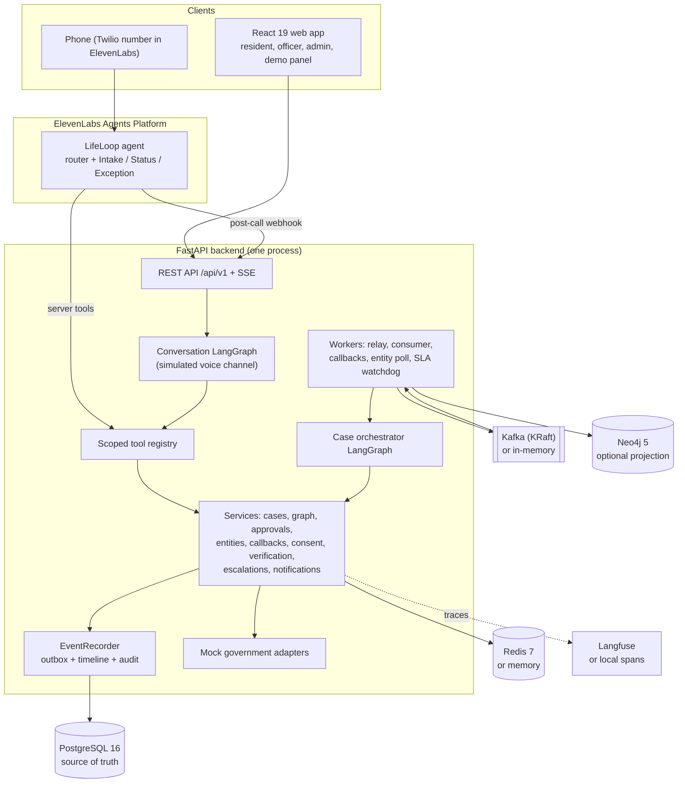

# Architecture overview

LifeLoop turns one phone call after a birth into one persistent case that coordinates six services: birth
certificate, MOFA attestation, the home-country consulate passport, residence visa, Emirates ID and the insurance
endorsement. This page is the ten-minute tour. The detailed pages are linked at the end.

## What the system does

1. A resident calls (or uses the web console). The agent reads a fixed disclosure, confirms the birth, captures the
   child's and parents' details once, and records consent.
2. LifeLoop builds a six-node **Life-Event Graph** for the case and tells the parent what LifeLoop will file and
   what the parent must attend (the consulate appointment and ICP biometrics).
3. A deterministic **orchestrator** prepares each filing when its dependency clears. An **Amer officer** reviews
   the minimised fields and releases it. A scoped **adapter** files it with the (mock) authority and polls status.
4. When a step is cleared, blocked, missing a document or stalled, LifeLoop **calls the parent back**, but only
   with a consent token and never after "stop calling".
5. Distress, an approval question, a disputed record, two failed verifications or a stall past SLA hands the case
   to a **named Amer officer** (warm transfer).

## Principles

| Principle | How the code enforces it |
|---|---|
| AI prepares, officers release, authorities decide | The agent's tool registry has no approve, release or reject tool ([tools.md](../agent/tools.md)); release lives in [`approval_service.py`](../../backend/app/services/approval_service.py) behind an officer check |
| LifeLoop never invents government status | Status reaches a node only through the adapter `get_status` contract and a validated transition ([life-event-graph.md](life-event-graph.md)) |
| The consulate is parent-reported | [`consulate_service.py`](../../backend/app/services/consulate_service.py) records milestones with `source = PARENT_REPORTED`; the consulate adapter refuses every call |
| Capture once | The case's Life-Event Passport write log (`cases.passport`) records where each field came from; re-collection increments `re_entry_count` |
| Minimise what crosses a boundary | Each adapter accepts only its form's fields; Emirates IDs leave as opaque tokens ([data-flow.md](data-flow.md)) |
| Every dependency has a fallback | Kafka, Redis, Neo4j, Langfuse, ElevenLabs, telephony, SMS and email each degrade to a local mode; PostgreSQL is the only hard dependency ([`infra.py`](../../backend/app/services/infra.py)) |

## Components



| Component | Code | Notes |
|---|---|---|
| API | [`backend/app/api/v1/`](../../backend/app/api/v1/) | FastAPI 0.141, OpenAPI at `/docs`, ReDoc at `/redoc` ([API overview](../api/overview.md)) |
| Conversation graph | [`agents/dialog/graph.py`](../../backend/app/agents/dialog/graph.py) | Runs the simulated voice channel; mirrors the ElevenLabs workflow ([sub-agents](../agent/sub-agents.md)) |
| Tool registry | [`agents/tools.py`](../../backend/app/agents/tools.py) | The only way either transport touches the case |
| Orchestrator | [`workflows/case_orchestrator.py`](../../backend/app/workflows/case_orchestrator.py) | Deterministic LangGraph; no LLM mutates state |
| Graph template | [`workflows/birth_expat.py`](../../backend/app/workflows/birth_expat.py) | Six nodes, dependencies, SLAs, sources |
| State machine | [`workflows/state_machine.py`](../../backend/app/workflows/state_machine.py) | Every node transition is validated here |
| Event recorder | [`events/recorder.py`](../../backend/app/events/recorder.py) | Single write path for domain events |
| Workers | [`workers/runner.py`](../../backend/app/workers/runner.py) | Started in-process when `RUN_WORKERS=true` |
| Adapters | [`integrations/government/`](../../backend/app/integrations/government/) | DEMO / MOCK only |
| Seed | [`seed/seed.py`](../../backend/app/seed/seed.py) | Idempotent; demo cases are built by running the real pipeline on a backdated clock |

## Technology

Backend: Python 3.12, FastAPI 0.141, Uvicorn 0.53, SQLAlchemy 2 (async) with asyncpg, PostgreSQL 16, Alembic,
Pydantic v2 and pydantic-settings, PyJWT, bcrypt, httpx, python-multipart, structlog with Logifyx as the sink,
Redis 7, Kafka (apache/kafka in KRaft mode, aiokafka), LangGraph, Langfuse (v4 SDK), Neo4j 5 (optional),
ElevenLabs, Prometheus client. Dependencies are managed with **uv** only.

Frontend: React 19, TypeScript 5.9, Vite 8, Tailwind CSS 4, React Router 7, TanStack Query 5, Zustand 5,
Framer Motion 13, GSAP 3.15, Lenis 1.3, boneyard-js (skeleton screens), Lucide React, `@elevenlabs/client`, and
LifeLoop's own i18n (en, ar, hi, ur, ml, tl; right-to-left for ar and ur). Light and dark themes come from design
tokens. No component library is used. See [Frontend](frontend.md).

## Frontend routes

| Area | Routes |
|---|---|
| Public | `/` (landing), `/architecture`, `/login`, `/register`, `/verify-email`, `/forgot-password`, `/reset-password`, `/accept-invite` |
| Resident | `/app` (home), `/app/intake`, `/app/voice`, `/app/cases/:ref` (case dashboard), `/app/cases/:ref/graph`, `/app/cases/:ref/timeline`, `/app/cases/:ref/documents`, `/app/settings` |
| Officer | `/officer` (cases), `/officer/approvals`, `/officer/blocked`, `/officer/escalations`, `/officer/callbacks`, `/officer/audit`, `/officer/analytics`, `/officer/cases/:ref` |
| Admin | `/admin/users`, `/admin/system` |
| Demo and testing | `/demo` (demo control panel, visually separate from the officer interface), `/agent-testing` |

## Roles

| Role | Can | Cannot |
|---|---|---|
| RESIDENT | Register, open a case (voice or web), call, report consulate milestones, upload documents, change consent, opt out | See other residents' cases, release a filing |
| OFFICER | See cases of their own service centre, release or reject prepared filings, request documents, resolve escalations, transfer | See other organisations' cases, start a resident call |
| ADMIN | Everything an officer can, across organisations; provision accounts by invitation; run agent sync | Remove their own admin access |
| Voice agent | Call the scoped tools for the one resident and case bound to the call | Approve, release or reject anything |

Access checks live in [`services/access.py`](../../backend/app/services/access.py). A case outside the caller's
scope returns `404`, so its existence is not revealed.

## Repository layout

```
backend/            FastAPI service, Alembic migrations, tests (uv project)
  app/agents/       conversation graph, NLU, tools, guardrails, prompts, Agent Testing scenarios
  app/api/v1/       routers (auth, users, cases, agent, officer, entities, demo, health, misc)
  app/events/       event catalogue, recorder, broker, relay, consumers, handlers
  app/integrations/ elevenlabs, government (mock), telephony, notifications, cache
  app/workflows/    Life-Event Graph template, state machine, case orchestrator
  app/knowledge/    read-only knowledge base (the agent's RAG source)
frontend/           React 19 + Vite app
docs/               this documentation
```

## Read next

- [System architecture](system-architecture.md): the three canvas zones and every boundary
- [Life-Event Graph](life-event-graph.md): nodes, states and transitions
- [Event-driven architecture](event-driven-architecture.md): outbox, Kafka and consumers
- [Agent overview](../agent/overview.md)

[Documentation index](../README.md)
