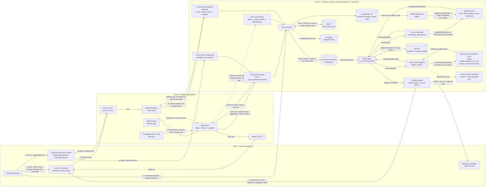

# System architecture

This page redraws Idea Canvas box L as it is built: three zones (caller and channel, ElevenLabs platform,
institution systems), every arrow labelled with what flows and in which direction, and every boundary where
personal data crosses marked with a filled dot (●).

## The three zones

Reading the diagram:

- **Solid arrows** are runtime data flows. **Dotted arrows** are after-the-call or observability flows.
- **●** marks an arrow on which personal data crosses a boundary. The [data-flow page](data-flow.md) lists exactly
  which fields cross each one and what is minimised.
- The **human gate** is a node in its own right: nothing reaches an authority adapter except through an officer's
  `Approve and Release` ([`approval_service.py`](../../backend/app/services/approval_service.py)).
- The **consulate** is drawn outside the adapter path: its adapter exists only to make the contract explicit, and
  every method raises `NotSupported` ([`authorities.py`](../../backend/app/integrations/government/authorities.py)).

## Two transports, one product

| Transport | When | Who understands speech | Who calls tools |
|---|---|---|---|
| **ElevenLabs** | `ELEVENLABS_API_KEY` and `ELEVENLABS_AGENT_ID` set and the service reachable | ElevenLabs (Scribe v2, the agent's LLM, the workflow router) | ElevenLabs, via server-tool webhooks to `POST /api/v1/agent/tools/{tool_name}` |
| **Simulated** | No ElevenLabs credentials, or ElevenLabs unavailable (also the demo "simulate ElevenLabs failure" switch) | The deterministic multilingual NLU in [`nlu.py`](../../backend/app/agents/dialog/nlu.py) | The LangGraph conversation graph, in-process |

Both transports use the same [tool registry](../agent/tools.md), the same disclosure text, the same guardrails and
the same case services. The simulated channel exists so the whole flow runs without credentials; it is labelled
"simulated" in `/ready` and in the UI.

## Arrow reference

| # | From → To | What flows | Personal data | Code |
|---|---|---|---|---|
| 1 | Resident → Twilio / web console | Voice or typed utterances | ● yes | [`call_service.py`](../../backend/app/services/call_service.py) |
| 2 | Channel → ElevenLabs | Audio over the ElevenLabs session (browser gets a signed URL; the API key stays on the server) | ● yes | `get_signed_url` in [`client.py`](../../backend/app/integrations/elevenlabs/client.py) |
| 3 | Knowledge base → agent | Published document lists, sourced fees, the 120-day rule | no | [`knowledge/`](../../backend/app/knowledge/) |
| 3a | ElevenLabs → initiation webhook | For a call to the life-event number: caller ID, called number, call SID; LifeLoop returns `lifeloop_call_id` and the disclosure | ● caller ID | `inbound_phone` in [`call_service.py`](../../backend/app/services/call_service.py) |
| 4 | Agent → tool registry | One scoped tool call with its validated arguments and the bound `lifeloop_call_id` | ● only that tool's arguments | [`api/v1/agent.py`](../../backend/app/api/v1/agent.py), [`tools.py`](../../backend/app/agents/tools.py) |
| 5 | ElevenLabs → post-call webhook | Transcript, analysis summary, data-collection results | ● yes, redacted before storage | [`webhook_service.py`](../../backend/app/services/webhook_service.py) |
| 6 | Services → outbox | Domain event in the same transaction as the state change | payload redacted | [`recorder.py`](../../backend/app/events/recorder.py) |
| 7 | Outbox → Kafka | Event message keyed by case id, plus an audit copy | redacted payload | [`relay.py`](../../backend/app/events/relay.py) |
| 8 | Kafka → orchestrator | Node-transition and case events | no | [`handlers.py`](../../backend/app/events/handlers.py) |
| 9 | Orchestrator → human gate | Prepared filing (approval row with minimised field preview) | ● minimised | [`case_orchestrator.py`](../../backend/app/workflows/case_orchestrator.py) |
| 10 | Officer → human gate | Approve and Release, Reject (with reason), Request documents | no | [`officer.py`](../../backend/app/api/v1/officer.py) |
| 11 | Adapter → authority | `SubmitRequest` with only the node's `form_fields`; Emirates IDs as `eidtok_…` tokens | ● minimised | [`entity_service.py`](../../backend/app/services/entity_service.py) |
| 12 | Authority → adapter | External reference and status (`SUBMITTED`, `PROCESSING`, `CLEARED`, `BLOCKED`, …) | no | [`base.py`](../../backend/app/integrations/government/base.py) |
| 13 | Resident → consulate node | Parent-reported milestone; "passport number available" flag, never the number | ● minimal | [`consulate_service.py`](../../backend/app/services/consulate_service.py) |
| 14 | Callback engine → channel | Outbound call (dynamic variables: case reference, language, script) or SMS with the case ID | ● yes | [`callback_service.py`](../../backend/app/services/callback_service.py) |
| 15 | Kafka → Neo4j | Case id, reference, status, emirate; node id, key, state, entity | no | [`neo4j_projection.py`](../../backend/app/graph/neo4j_projection.py) |
| 16 | Services → Langfuse | Spans with inputs and outputs passed through `redact_value` and the Langfuse `mask` hook | redacted | [`tracing.py`](../../backend/app/observability/tracing.py) |

## When a dependency is down

The canvas requires the diagram to show what happens when a dependency is down. In the code, every dependency
except PostgreSQL has a fallback, and the case never advances on a guess.

| Dependency | What LifeLoop does | Where |
|---|---|---|
| Government authority (timeout, 503, malformed) | Retries with backoff (`ADAPTER_MAX_ATTEMPTS`), then marks the node **STALLED** "not cleared yet"; an officer can retry | [`entity_service.py`](../../backend/app/services/entity_service.py) |
| Authority past its SLA | SLA watchdog marks the node **STALLED**, orchestrator escalates to an officer and calls the parent | [`jobs.py`](../../backend/app/workers/jobs.py) |
| Consulate silent for `CONSULATE_STALL_DAYS` (56) | Escalation `CONSULATE_STALL`; the agent still never claims a status | [`jobs.py`](../../backend/app/workers/jobs.py) |
| Kafka | Events stay `PENDING` in the outbox and are relayed in order when the broker returns; unreachable at start-up means the in-memory broker | [Event-driven architecture](event-driven-architecture.md#when-kafka-is-down) |
| Redis | In-process memory cache for that call; `/ready` reports `memory-fallback` | [Redis](../integrations/redis.md) |
| Neo4j | PostgreSQL answers impact and bottleneck queries | [Neo4j](../integrations/neo4j.md) |
| Langfuse | Spans become structured log lines and a 200-entry in-memory buffer | [Langfuse](../integrations/langfuse.md) |
| ElevenLabs | Calls fall back to the simulated dialog engine with the same tools and guardrails | [ElevenLabs](../integrations/elevenlabs.md) |
| Telephony | Callback marked `FAILED` and an SMS carries the case ID and a callback offer; the case never advances on SMS alone | [Telephony](../integrations/telephony.md) |
| PostgreSQL | `/ready` returns `503`; nothing is accepted | [`health.py`](../../backend/app/api/v1/health.py) |

`GET /ready` reports every dependency with its live or fallback mode, so the state shown on the dashboard is the
state the code is in.

## Related

- [Data flow](data-flow.md) for field-level detail at each ● boundary
- [Event-driven architecture](event-driven-architecture.md)
- [Threat model](../security/threat-model.md) for the same boundaries seen as trust boundaries
- [Architecture overview](overview.md)

[Documentation index](../README.md)
