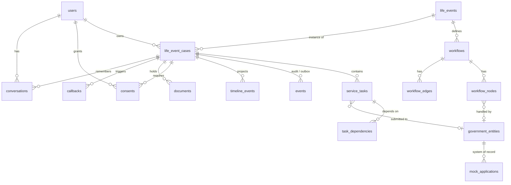

# Database

PostgreSQL 16, SQLAlchemy 2.x (async), Alembic migrations (`backend/alembic/versions`). All tables have UUID primary keys and `created_at` / `updated_at`. Enumerations are stored as strings with CHECK constraints (portable and migration-friendly). JSON columns use `JSONB` on PostgreSQL.



| Table | Notes |
|---|---|
| `users` | role (`RESIDENT`/`OPERATOR`/`GOVERNMENT_ENTITY`/`ADMIN`), preferred language, optional phone. `revoked_tokens` is the logout/rotation denylist. |
| `government_entities` | code, slug, name, configured average processing time. |
| `life_events` | template code (`BIRTH`, `MARRIAGE`, `MOVE`, `BUSINESS_START`), `is_configured`. |
| `workflows`, `workflow_nodes`, `workflow_edges` | versioned definition. Node `config` JSON: `max_attempts`, `alternative`, `started_label`, `completed_label`. Unique `(workflow_id, key)`, edge unique `(from,to)` and CHECK `from <> to`. |
| `life_event_cases` | `reference` (`L-49281`, unique), status, event date, `participants`, `preferences`, `memory` (passport), optional idempotency key. |
| `service_tasks` | status, `external_ref` (authority application), unique `idempotency_key`, `attempts`, `required_documents`, `resident_action`, timestamps. Unique `(case_id, key)`. |
| `task_dependencies` | per-case edges, unique `(task_id, depends_on_id)`. |
| `events` | domain event + audit + outbox (see [event-model.md](event-model.md)). Unique `idempotency_key`. |
| `timeline_events` | resident-facing projection; index on `occurred_at`. |
| `consents` | type, status, version, scope, source, `captured_at`. |
| `documents` | type, name, status (`REQUESTED`/`RECEIVED`/`ACCEPTED`), verification status, storage key. |
| `callbacks` | status, reason, trigger event, schedule, duration, outcome, provider, payload (`updates`, `script`), unique idempotency key. |
| `conversations` | channel, provider ids, transcript JSON, dialog state, duration, linked callback. |
| `mock_applications` | the mock authorities' own store: reference, status, history, required documents, unique idempotency key. |

**Indexes** (per the spec): `case_id` on tasks/events/timeline/consents/documents/callbacks/conversations, `status` on cases/tasks/callbacks/documents, `entity_id` on tasks/nodes, `event_type` on events/timeline, `created_at` via `events.created_at` ordering and `timeline_events.occurred_at`.

## Migrations

```bash
make migrate                       # alembic upgrade head (in the backend container)
make migration m="add something"   # autogenerate (local)
```

The backend container runs `alembic upgrade head` and the idempotent seed on every start.

## Seed

`python -m app.seed.seed_data` (`make seed`): entities, life events, workflows/nodes/edges, demo user, and the demo case **L-49281** produced by driving the real engine under a controlled clock (so its tasks, timeline, callbacks, conversation and audit log are genuine). Every step is get-or-create; a second run changes nothing. `--reset-demo` rebuilds only L-49281.
