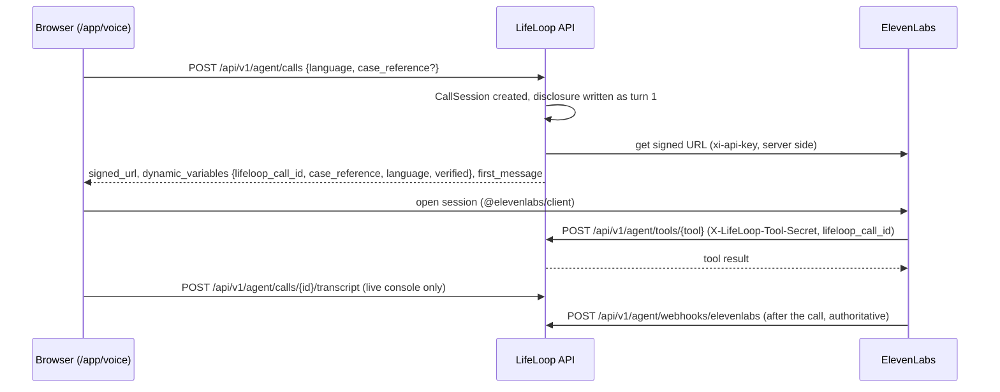

# ElevenLabs integration

ElevenLabs runs the live voice agent. LifeLoop defines the agent in code, keeps the API key on the server, exposes
scoped server tools, and treats the post-call webhook as the authoritative record of each call. Without ElevenLabs
credentials, the same flow runs on the simulated channel ([Agent overview](../agent/overview.md#two-transports)).

> **API field names.** The agent, workflow, tool, webhook and Agent Testing field names in this integration follow
> the public ElevenLabs APIs at the time of writing. Confirm them against the current ElevenLabs API reference before
> syncing to a production workspace. `POST /api/v1/agent/sync?dry_run=true` lets you review the exact payload first.

## Components used (canvas box J)

| Component | Ticked | Where in LifeLoop |
|---|---|---|
| Agents Platform | yes | One agent defined by `build_agent_config` in [`agent.py`](../../backend/app/integrations/elevenlabs/agent.py) |
| Agent Workflows | yes | State router node with LLM-evaluated edges ([Sub-agents](../agent/sub-agents.md#elevenlabs-agent-workflow)) |
| Sub-agents | yes | Intake, Status, Exception (`override_agent` nodes) |
| Eleven v3 TTS | yes | `conversation_config.tts.model_id = ELEVENLABS_TTS_MODEL` (default `eleven_v3`); also `POST /api/v1/agent/tts` for the web console |
| Scribe v2 STT | yes | Agent ASR; also `POST /api/v1/agent/stt` with `ELEVENLABS_STT_MODEL` (default `scribe_v2`) |
| Knowledge base + RAG | yes | The eight documents in [`backend/app/knowledge/`](../../backend/app/knowledge/) uploaded at sync, RAG enabled |
| Server / client tools | yes | 18 webhook tools, one per scoped action ([Tools](../agent/tools.md)) |
| Telephony (Twilio / SIP) | yes | Calls to the life-event number bound through the conversation-initiation webhook, and outbound callbacks through ElevenLabs' Twilio integration ([Telephony](telephony.md)) |
| Agent Testing | yes | Seven ElevenLabs test definitions, created and run in the workspace by `POST /api/v1/agent/testing/sync`, plus the ten-scenario LifeLoop suite ([Agent Testing](../agent/testing.md)) |
| Post-call webhooks | yes | `POST /api/v1/agent/webhooks/elevenlabs` |
| Voice Design, MCP servers, Batch calling, WhatsApp, Bring-your-own LLM | no | Not load-bearing for a phone-first pilot (canvas box J) |
| Web / mobile SDKs | no (in the canvas) | The prototype's web voice console uses `@elevenlabs/client` so evaluators can talk to the agent in a browser; the pilot design remains phone-first |

## Configuration

| Variable | Default | Purpose |
|---|---|---|
| `ELEVENLABS_API_KEY` | empty | Server-side API key. Never sent to the browser |
| `ELEVENLABS_AGENT_ID` | empty | The agent to use. With the key, this switches calls from simulated to ElevenLabs |
| `ELEVENLABS_PHONE_NUMBER_ID` | empty | A Twilio number imported in ElevenLabs; enables real outbound callbacks |
| `ELEVENLABS_VOICE_ID` | empty | Voice for the agent and for `/api/v1/agent/tts` |
| `ELEVENLABS_WEBHOOK_SECRET` | empty | HMAC secret for the post-call webhook. Required in production |
| `ELEVENLABS_BASE_URL` | `https://api.elevenlabs.io` | API base URL |
| `ELEVENLABS_TIMEOUT_SECONDS` | `15.0` | Per-request timeout |
| `ELEVENLABS_TTS_MODEL` | `eleven_v3` | TTS model id |
| `ELEVENLABS_STT_MODEL` | `scribe_v2` | STT model id |
| `VOICE_TOOL_SECRET` | `dev-voice-tool-secret` | Shared secret ElevenLabs sends as `X-LifeLoop-Tool-Secret` on every server-tool call and on the conversation-initiation webhook. Startup fails in production if left at the default |
| `WEBHOOK_TOLERANCE_SECONDS` | `300` | Replay window for webhook signatures |
| `PUBLIC_BASE_URL` | `http://localhost:8000` | Backend URL as ElevenLabs sees it; tool URLs are built from it. Use an HTTPS tunnel for local live testing |

## The API client

[`client.py`](../../backend/app/integrations/elevenlabs/client.py) is the only place that builds ElevenLabs URLs.
It retries timeouts, HTTP 429 and 5xx with exponential backoff (3 attempts), maps other errors to
`ElevenLabsError`, and supports a demo switch (`simulate_unavailable`).

| Method | ElevenLabs endpoint | Used for |
|---|---|---|
| `get_signed_url` | `GET /v1/convai/conversation/get-signed-url?agent_id=` | Browser voice sessions without exposing the key |
| `create_agent` / `update_agent` / `get_agent` | `POST /v1/convai/agents/create`, `PATCH /v1/convai/agents/{id}`, `GET /v1/convai/agents/{id}` | Agent sync |
| `get_conversation` | `GET /v1/convai/conversations/{id}` | Available for reconciliation (not called by a route in this build) |
| `outbound_call` | `POST /v1/convai/twilio/outbound-call` | Real callbacks |
| `create_kb_text` | `POST /v1/convai/knowledge-base/text` | Knowledge base upload at sync |
| `create_agent_test` / `run_agent_tests` | `POST /v1/convai/agent-testing/create`, `POST /v1/convai/agents/{id}/run-tests` | Agent Testing sync (`POST /api/v1/agent/testing/sync`) |
| `text_to_speech` | `POST /v1/text-to-speech/{voice_id}` (mp3) | Web console TTS |
| `speech_to_text` | `POST /v1/speech-to-text` | Web console STT |

## Browser voice session

If the signed URL cannot be obtained, the call is switched to the simulated provider and the response carries a
`fallback_reason`.

## Server tools

Each `ToolSpec` becomes a `webhook` tool whose URL is `{PUBLIC_BASE_URL}/api/v1/agent/tools/{name}`:

- **Shared secret**: the tool's `request_headers` include `X-LifeLoop-Tool-Secret: <VOICE_TOOL_SECRET>`. The
  endpoint compares it in constant time and returns `401 invalid_tool_secret` otherwise.
- **Call binding**: the request body requires `lifeloop_call_id`, filled by ElevenLabs from the dynamic variable of
  the same name. The backend loads that call, requires it to be `ACTIVE` or `RINGING` with a user, and runs the tool
  as that resident on that case only.
- **Arguments** are nested under `arguments` and validated by the tool's Pydantic model.

Where `lifeloop_call_id` comes from:

| Conversation | Bound by |
|---|---|
| Web voice console | `POST /api/v1/agent/calls` returns it with the signed URL |
| Call to the life-event number | The [conversation-initiation webhook](#conversation-initiation-webhook) returns it |
| Outbound callback on a phone | The callback engine creates the call before dialling and passes it in `conversation_initiation_client_data` ([Telephony](telephony.md#elevenlabs--twilio-outbound-calls)) |

The full catalogue is in [Tools](../agent/tools.md).

## Conversation-initiation webhook

`POST /api/v1/agent/webhooks/elevenlabs/initiation`, authenticated with the same `X-LifeLoop-Tool-Secret` header,
binds a call placed **to** the life-event number before the conversation starts. It matches the resident by caller
ID (or creates a phone-only resident), creates an unverified `CallSession`, records the disclosure as turn 1, and
returns `conversation_initiation_client_data` with the dynamic variables (`lifeloop_call_id`, `case_reference`,
`language`, `verified: "false"`) and a `conversation_config_override` that sets the agent language and the
disclosure as `first_message`. Configure it in the ElevenLabs workspace for the imported phone number; details in
[Telephony](telephony.md#inbound-calls-to-the-life-event-number).

## Post-call webhook

`POST /api/v1/agent/webhooks/elevenlabs` ([`webhook_service.py`](../../backend/app/services/webhook_service.py)):

| Check | Behaviour |
|---|---|
| Signature | Header `ElevenLabs-Signature: t=<unix>,v0=<hex>`, where `v0 = HMAC-SHA256(ELEVENLABS_WEBHOOK_SECRET, "<t>.<raw body>")`, compared in constant time. Invalid → `401 invalid_signature`, audited as `WebhookRejected` |
| Replay window | `t` must be within `WEBHOOK_TOLERANCE_SECONDS` (300 s) of the server clock |
| Replay of the same signature | Each signature is accepted once (cache nonce kept for twice the window); a replay returns `{"status": "duplicate"}` |
| Idempotency | One `integration_events` row per `elevenlabs:<type>:<conversation_id>`; a provider retry returns `duplicate` and is not re-processed |
| No secret configured | Accepted outside production (signature recorded as unknown); **rejected** when `ENVIRONMENT=production` (`webhook_not_configured`) |
| Storage | The payload is redacted (`redact_value`) before it is stored |
| Processing | Only `post_call_transcription` is processed, asynchronously by the `post-call` consumer; other types are recorded and marked processed |

The consumer matches the call by the `lifeloop_call_id` dynamic variable, or by `conversation_id`; writes the
transcript (redacted) if the live console did not already; audits `DisclosureMissing` if the first agent turn is not
the disclosure; stores the summary and the data-collection results (redacted); records `CALLBACK` consent when
`consent_callback` is true; closes the call and its callback; and emits `PostCallProcessed`.

Data collection fields defined on the agent:

| Field | Type | Meaning |
|---|---|---|
| `consent_callback` | boolean | True only if the caller explicitly agreed to be called back |
| `disclosure_delivered` | boolean | True if the first agent utterance was the disclosure |
| `language` | string | The language the call was conducted in |
| `escalation_requested` | boolean | True if the call was handed to a human officer |
| `consulate_milestone` | string | Any consulate milestone the parent reported, verbatim |

To exercise this path without ElevenLabs, the demo panel's "send post-call webhook" control
(`POST /api/v1/demo/cases/{ref}/webhook`) builds an ElevenLabs-format payload, signs it with the configured secret,
and sends it through the same verification code.

## Knowledge base and RAG

The read-only knowledge base is eight Markdown files with front matter (`id`, `title`, `entity`, `source`,
`fees`). A fee exists only if a document lists it with its source; today that is the MOFA attestation fee
(AED 150) and the overstay fine range (AED 25-100 per day), both from the Idea Canvas and both marked "confirm
against the current schedule". At sync, each document is uploaded as a text knowledge-base item and attached with
`usage_mode: auto`; RAG is enabled on the agent. The same documents back `get_knowledge_document` and
`GET /api/v1/knowledge`.

## Agent sync

`POST /api/v1/agent/sync` (admin only) builds the agent definition from code: system prompt, tools, workflow,
language presets, TTS and ASR settings, data collection and platform overrides.

| Call | Result |
|---|---|
| `POST /api/v1/agent/sync?dry_run=true` (the default) | Returns `{"dry_run": true, "configured": <bool>, "config": {...}}`. Nothing is sent. Use this to review the payload |
| `POST /api/v1/agent/sync?dry_run=false` with no `ELEVENLABS_AGENT_ID` | Uploads the knowledge base, creates the agent, returns its `agent_id` and "Set ELEVENLABS_AGENT_ID to this id and restart the backend" |
| `POST /api/v1/agent/sync?dry_run=false` with `ELEVENLABS_AGENT_ID` | Uploads the knowledge base and updates the agent in place |

Each non-dry-run sync uploads the knowledge documents again; old knowledge-base items are not deleted by LifeLoop.

## Connecting a real agent

1. Create an ElevenLabs API key with access to Agents, TTS and STT. Set `ELEVENLABS_API_KEY`.
2. Expose the backend over HTTPS (for local testing, a tunnel such as ngrok) and set `PUBLIC_BASE_URL` to it.
3. Set a long random `VOICE_TOOL_SECRET`.
4. Optionally set `ELEVENLABS_VOICE_ID`.
5. Sign in as `demo.admin@lifeloop.local` and call `POST /api/v1/agent/sync?dry_run=true`; review the payload
   against the current ElevenLabs API reference.
6. Call `POST /api/v1/agent/sync?dry_run=false`, put the returned id in `ELEVENLABS_AGENT_ID`, restart the backend.
7. In ElevenLabs, configure the post-call webhook to `{PUBLIC_BASE_URL}/api/v1/agent/webhooks/elevenlabs`, copy its
   signing secret into `ELEVENLABS_WEBHOOK_SECRET`, restart.
8. Call `POST /api/v1/agent/testing/sync` (admin) to create the seven Agent Testing definitions in the workspace and
   run them against the agent. Repeat before each release.
9. For the phone line, import a Twilio number (or SIP trunk) in ElevenLabs, assign the agent, and set its
   conversation-initiation webhook to `{PUBLIC_BASE_URL}/api/v1/agent/webhooks/elevenlabs/initiation` with the
   header `X-LifeLoop-Tool-Secret: <VOICE_TOOL_SECRET>`.
10. For phone callbacks, set `ELEVENLABS_PHONE_NUMBER_ID` to that number's id and make sure residents have a phone
    number on file.
11. Check `GET /ready`: `dependencies.elevenlabs.provider` should be `elevenlabs` and `dependencies.telephony.mode`
    `ELEVENLABS`.

## Related

- [Agent overview](../agent/overview.md)
- [Tools](../agent/tools.md)
- [Telephony](telephony.md)
- [Threat model](../security/threat-model.md)

[Documentation index](../README.md)
