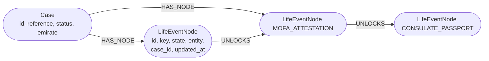

# Neo4j

PostgreSQL is authoritative for every Life-Event Graph. Neo4j 5 is an optional **read model** rebuilt from it, used
for two graph questions ([`neo4j_projection.py`](../../backend/app/graph/neo4j_projection.py)):

- **Impact**: "if this node is stalled, which downstream services are held up?" (variable-length `UNLOCKS` paths).
- **Bottlenecks**: "across all cases, which entities and nodes stall or block most often?" (officer analytics).

Every caller has a PostgreSQL fallback, so the product runs unchanged when Neo4j is absent.

## Configuration

| Variable | Default | Purpose |
|---|---|---|
| `NEO4J_URI` | empty | Compose sets `bolt://neo4j:7687` for the backend container; `.env.example` sets `bolt://localhost:7687` for host runs. Empty disables the projection |
| `NEO4J_USERNAME` | `neo4j` | |
| `NEO4J_PASSWORD` | empty | Compose uses `lifeloop-neo4j` unless `.env` sets another value (it also configures the Neo4j server with it) |

Docker Compose runs `neo4j:5-community` with a health check (`cypher-shell 'RETURN 1'`) and its data in the
`neo4jdata` volume; the browser UI is on `NEO4J_HTTP_PORT` (7474) and Bolt on `NEO4J_BOLT_PORT` (7687).

At start-up LifeLoop verifies connectivity and creates two uniqueness constraints (`LifeEventNode.id`, `Case.id`).
On failure the mode is `postgres-fallback`. `/ready` shows `dependencies.neo4j` (`disabled`, `neo4j` or
`postgres-fallback`) and the case graph API returns the current projection mode.

## Model

No personal data crosses into Neo4j: no names, dates of birth, nationalities or identifiers, only ids, keys, states
and entity codes.

## When it is written

The `graph-projection` consumer re-projects a case on every node-transition event and on `IntakeCompleted`
(`MERGE` upserts, so re-projection is idempotent). The demo reset deletes the demo case's projection before
rebuilding it. A failed projection is logged and does not affect the case.

## Queries

| Question | Cypher (simplified) | API | PostgreSQL fallback |
|---|---|---|---|
| Downstream impact of a node | `MATCH (n:LifeEventNode {id: $id})-[:UNLOCKS*1..10]->(d) RETURN DISTINCT d.key, d.state, d.entity` | `GET /api/v1/cases/{ref}/graph/impact/{node_key}` (`source: neo4j` or `postgres`) | Breadth-first walk over `life_event_edges` |
| Bottlenecks across cases | Nodes in STALLED, BLOCKED, DOCUMENT_MISSING, REJECTED, WAITING_FOR_PARENT with the count of nodes they hold downstream | `GET /api/v1/officer/analytics` (`bottlenecks.source`) | Count of nodes per key, entity and state |

The analytics result is scoped per organisation in PostgreSQL; the Neo4j bottleneck query in this build runs across
all projected cases.

## Related

- [Life-Event Graph](../architecture/life-event-graph.md)
- [Event-driven architecture](../architecture/event-driven-architecture.md)
- [Redis](redis.md)

[Documentation index](../README.md)
