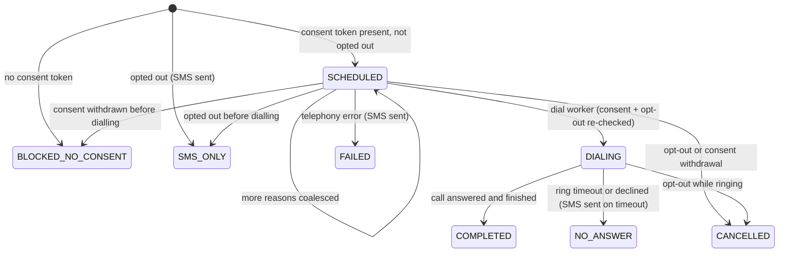

# Telephony and SMS

Canvas box L: "IN → resident dials the life-event number (Twilio / SIP) → audio to agent. OUT ← callback engine
dials on every state change; refuses to dial without a consent token. Fallback: telephony down → SMS carrying the
case ID and a callback offer. The case never advances on SMS alone."

LifeLoop has two telephony providers and two SMS providers, chosen from configuration at start-up
([`providers.py`](../../backend/app/integrations/telephony/providers.py),
[`sms.py`](../../backend/app/integrations/notifications/sms.py)).

| Channel | Live provider | Selected when | Fallback |
|---|---|---|---|
| Inbound voice (calls to the life-event number) | The ElevenLabs agent answers a Twilio / SIP number imported in ElevenLabs; LifeLoop binds the call through the [conversation-initiation webhook](#inbound-calls-to-the-life-event-number) | The number is imported in ElevenLabs and its initiation webhook points at LifeLoop | The web voice console (`/app/voice`) |
| Outbound voice (callbacks) | `ElevenLabsTwilioTelephony`: the ElevenLabs agent places the call on the imported Twilio number | `ELEVENLABS_API_KEY`, `ELEVENLABS_AGENT_ID` and `ELEVENLABS_PHONE_NUMBER_ID` are set | `SimulatedTelephony`: the callback rings in the resident's LifeLoop app (`/app/voice`) |
| SMS | `TwilioSms`: Twilio Messages REST API | `TWILIO_ACCOUNT_SID`, `TWILIO_AUTH_TOKEN`, `TWILIO_PHONE_NUMBER` are set | `MockSms`: messages are recorded (last 100, phone masked) and labelled `is_mock` |

`GET /ready` reports `dependencies.telephony.mode` (`SIMULATED` or `ELEVENLABS`) and `dependencies.sms`
(`MOCK_SMS` or `TWILIO`). Mock SMS messages are visible in the demo panel (`GET /api/v1/demo`, `mock_sms`).

## Inbound calls to the life-event number

`POST /api/v1/agent/webhooks/elevenlabs/initiation` is the ElevenLabs **conversation-initiation webhook** for calls
placed to the life-event number ([`agent.py`](../../backend/app/api/v1/agent.py), `CallService.inbound_phone` in
[`call_service.py`](../../backend/app/services/call_service.py)). ElevenLabs calls it before the conversation starts.

```mermaid
sequenceDiagram
  participant P as Parent's phone
  participant EL as ElevenLabs (Twilio / SIP number)
  participant API as POST /agent/webhooks/elevenlabs/initiation
  participant T as POST /agent/tools/{tool}

  P->>EL: dials the life-event number
  EL->>API: caller_id, called_number, call_sid (X-LifeLoop-Tool-Secret)
  API->>API: match resident by caller ID (last 9 digits), or create a phone-only resident
  API->>API: CallSession INBOUND, ELEVENLABS, verified = false; disclosure recorded as turn 1
  API-->>EL: dynamic_variables {lifeloop_call_id, case_reference, language, verified: "false"} + first_message = disclosure
  EL->>P: disclosure, then the conversation
  EL->>T: server tools with lifeloop_call_id
```

| Step | Behaviour |
|---|---|
| Authentication | The same `X-LifeLoop-Tool-Secret` header as the server tools (`401` otherwise) |
| Request | `caller_id` (required, 4-32 chars), optional `agent_id`, `called_number`, `call_sid`. A caller ID with fewer than 7 digits is refused (`403`) |
| Resident match | An existing resident whose phone number ends in the same last 9 digits. Otherwise LifeLoop creates a **phone-only resident** (no password, name "Caller +971•••••NN", the caller's number) so a first-time caller can open a case by voice. A phone-only resident cannot sign in to the web app |
| Case | The resident's active case, if any, is bound to the call |
| Call | A `CallSession` (direction `INBOUND`, provider `ELEVENLABS`, state `ACTIVE`, `verified = false`) with the Twilio call SID and the masked called number; the disclosure is written as transcript turn 1; `CallStarted` is recorded |
| Response | `{"type": "conversation_initiation_client_data", "dynamic_variables": {"lifeloop_call_id", "case_reference", "language", "verified": "false"}, "conversation_config_override": {"agent": {"language", "first_message": <disclosure>}}}` |

Telephone callers are **not verified** by their caller ID. They can open a new case (`create_case` does not need
verification), stop calls and ask for a person, but every case-revealing tool returns `verification_required`
until they verify with UAE Pass (simulated) or the child's date of birth and hospital. Email verification gates only
the **web** intake; voice callers are identified by phone and verification. This flow is covered by
`test_phone_call_to_the_life_event_line_binds_tools` in [`test_agent.py`](../../backend/tests/test_agent.py).

The webhook URL and its header are configured in the ElevenLabs workspace for the phone number or agent; they are
not part of `POST /api/v1/agent/sync`. Confirm the request and response field names against the current ElevenLabs
API reference.

## Callback lifecycle



| Setting | Default | Effect |
|---|---|---|
| `CALLBACK_COALESCE_SECONDS` | 3.0 | Updates within this window share one call |
| `CALLBACK_RING_TIMEOUT_SECONDS` | 180 | A ringing callback not answered in time becomes `NO_ANSWER` and an SMS is sent |

Callback reasons: `CLEARED`, `COMPLETED`, `BLOCKED`, `DOCUMENT_MISSING`, `STALLED`, `HUMAN_ESCALATION`,
`PARENT_INPUT` (consulate milestone), `BIOMETRICS`, `CASE_COMPLETE`, and `STATUS` (resident or demo request). The
script is composed from every coalesced reason in the case language, with step names localised
([`callback_service.py`](../../backend/app/services/callback_service.py)).

When a callback is due, the dial worker re-checks opt-out and consent, then **creates the `CallSession` before
dialling** (direction `OUTBOUND`, state `RINGING`, linked to the callback) so its id can be handed to the voice
provider. A telephony error marks the call `FAILED` and the callback `FAILED`, and sends an SMS.

## Simulated telephony

No phone call is placed. The `CallSession` stays `RINGING`, `CallbackDialed` is recorded, and an in-app
notification "LifeLoop is calling you" links to the voice screen. `GET /api/v1/agent/calls/ringing` lists the
resident's ringing callbacks, which the app shows as an incoming call. Answering
(`POST /api/v1/agent/calls/{id}/answer`) speaks the callback disclosure, then the same verification, dialog engine,
tools and guardrails as a real call take over. Declining (`POST /api/v1/agent/calls/{id}/end` while ringing) records
`NO_ANSWER`. Callbacks on the seeded case `LL-DEMO-001` ring in `demo.resident@lifeloop.local`'s app.

This is how the canvas box O "three event-driven outbound callbacks including one blocked-node call" can be
demonstrated without telephony credentials.

## ElevenLabs + Twilio outbound calls

When configured, the dial worker calls `POST /v1/convai/twilio/outbound-call` with the agent id, the phone number id,
the resident's phone number and `conversation_initiation_client_data.dynamic_variables`:

| Dynamic variable | Value |
|---|---|
| `lifeloop_call_id` | The `CallSession` created before dialling: server tools bind to this call, case and resident |
| `case_reference` | e.g. `LL-2026-000012` |
| `language` | Case language |
| `callback_id` | The callback being placed |
| `verified` | `"false"`: the person who answers must verify before case details are shared |
| `callback_script` | The composed update, in the case language |
| `consent_token_present` | `true` (the call is never placed otherwise) |

On success the call becomes `ACTIVE` (ElevenLabs owns the conversation) and the returned `conversation_id` is stored
so the post-call webhook can be matched to it. A `TelephonyError` (no phone number on file, ElevenLabs unavailable)
marks the callback `FAILED` and sends an SMS: "LifeLoop tried to call about case {ref}. Reply CALL to request a
callback, or open the LifeLoop app."

## SMS fallback

SMS is used for opt-out confirmation, for every update while a case is SMS-only, for missed or failed calls, and
when telephony is down. Every SMS carries the case reference. SMS is queued through the outbox
(`NotificationRequested`) and sent by the `notifier` consumer; a row already `SENT` is never sent again.

The case **never advances on SMS alone**: there is no inbound SMS handler, so nothing a resident texts back can change
a node. The "Reply CALL" wording in the SMS templates anticipates an inbound handler that is **planned, not built**;
today the resident requests a callback in the app (`POST /api/v1/cases/{ref}/callbacks`) or calls the life-event
number.

## Known gaps

These are honest limitations of the current telephony integration:

| Gap | Effect | Planned fix |
|---|---|---|
| No inbound SMS | "Reply CALL" is not processed | Twilio inbound SMS webhook |
| No live voice bridge to the officer | A warm transfer opens the escalation (with the case, transcript and reason), marks the call `TRANSFERRED` and records `CallTransferred`; it does not patch the audio through to the officer | Transfer-to-number / SIP transfer |
| Caller ID is not proof of identity | A caller is matched to a resident by caller ID but starts unverified; case details need verification. A spoofed caller ID could still open a new case, stop calls or ask for a person on that resident's behalf | Real UAE Pass verification at the start of phone calls |
| UAE Pass is simulated | Verification by UAE Pass is a one-tap action, not the UAE Pass mobile approval flow | Real UAE Pass integration ([Production](../deployment/production.md)) |

## Related

- [Call flow](../agent/call-flow.md#step-4-file-then-call-back-on-each-state-change)
- [ElevenLabs](elevenlabs.md)
- [Guardrails](../agent/guardrails.md#consent-to-be-called)
- [SECURITY.md](../../SECURITY.md)

[Documentation index](../README.md)
