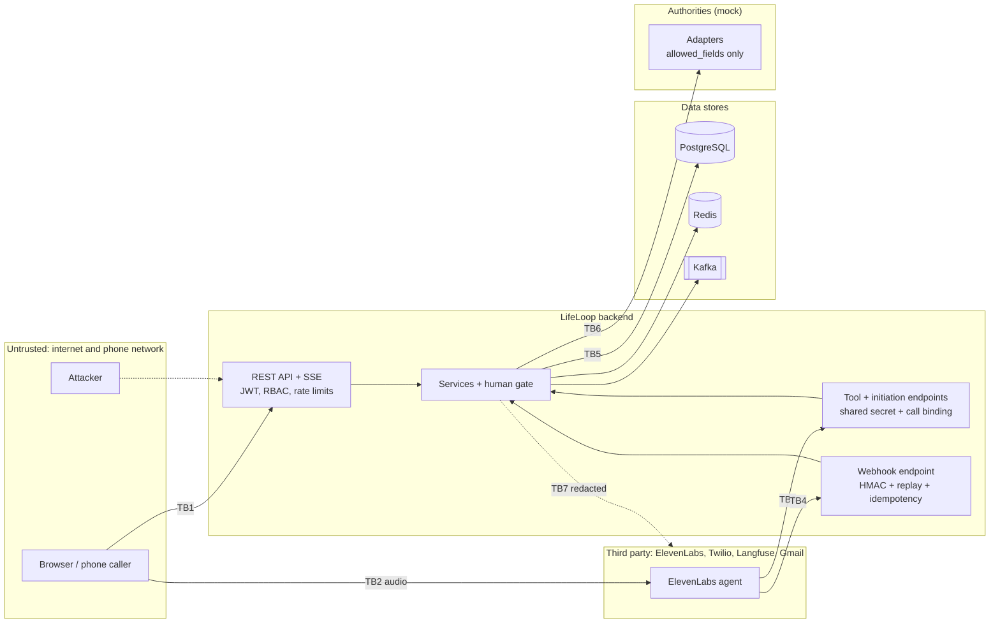

# Threat model

Scope: the LifeLoop prototype as built in this repository (FastAPI backend, React frontend, ElevenLabs agent,
mock government adapters, PostgreSQL, Redis, Kafka, Neo4j, Langfuse). It is a prototype for the
"Ignyte × ElevenLabs Voice Agent Challenge"; the model below is written so a reviewer can see which controls exist
in code today and which would be needed for a real pilot ([Production](../deployment/production.md)).

## Assets

| Asset | Why it matters | Where it lives |
|---|---|---|
| Child and parent personal data (names, date and place of birth, nationality) | Identity data of a newborn and their parents | PostgreSQL (`children`, `parents`, `cases.passport` write log) |
| Emirates ID numbers | National identifiers | Never stored in clear: keyed hash + last four digits; briefly in the cache during voice intake |
| Passport numbers | Travel document identifiers | Never stored; only "available: yes/no" |
| Call transcripts and summaries | May contain anything a caller says | PostgreSQL (`transcripts`, `call_sessions`), redacted before storage; ElevenLabs (if used) under its retention |
| Consent records and tokens | Legal basis for calling a family | PostgreSQL (`consents`, `opt_outs`) |
| Case state and the officer gate | Integrity of what is filed with authorities | PostgreSQL (`life_event_nodes`, `approvals`, `entity_requests`) |
| Uploaded documents | Copies of certificates and passports | Local storage directory (`STORAGE_DIR`) |
| Audit trail | Accountability for every decision | PostgreSQL (`audit_logs`, `case_events`, `officer_reviews`) |
| Secrets | `JWT_SECRET`, `PII_HASH_KEY`, `VOICE_TOOL_SECRET`, `ELEVENLABS_*`, `TWILIO_*`, `LANGFUSE_*`, `GMAIL_CREDENTIALS_B64` | Environment (`.env`) |

## Actors

| Actor | Trust | Notes |
|---|---|---|
| Resident (parent) | Authenticated, owns their cases | May be distressed; may be targeted by impersonators |
| Amer officer | Authenticated staff, organisation-scoped | Can release filings for their service centre only |
| Administrator | Authenticated, platform-wide | Provisions accounts, syncs the agent |
| The voice agent (LLM) | **Untrusted for decisions** | Can only call scoped tools; cannot approve; its words are checked by Agent Testing |
| ElevenLabs platform | Third-party processor | Holds call audio and transcripts during and after calls; calls LifeLoop tools and webhooks |
| Government authorities | External systems (mocked here) | Receive only minimised form fields |
| Home-country consulate | Outside the system | No integration; parent-reported only |
| External attacker | Untrusted | Internet-facing API, webhook and tool endpoints; phone-based social engineering |
| Malicious insider | Partially trusted | Officer or admin abusing access |

## Trust boundaries

| Boundary | Crossing | Controls in code |
|---|---|---|
| TB1 | Browser → API | JWT bearer auth, role checks, organisation and ownership checks (`404` for out-of-scope cases), rate limits on auth and voice turns, Pydantic validation, security headers (CSP `default-src 'none'` on API responses, `X-Frame-Options: DENY`, `nosniff`, `Referrer-Policy: no-referrer`, HSTS in production), CORS allow-list |
| TB2 | Caller → ElevenLabs | Fixed disclosure; the agent never reads identifiers back |
| TB3 | ElevenLabs → tool endpoint and conversation-initiation webhook | `X-LifeLoop-Tool-Secret` (constant-time compare) on both; tools need a call id LifeLoop issued, bound to an active call and its resident; per-tool validation, ownership and verification checks; no approval tool. Phone callers are bound by caller ID but start unverified |
| TB4 | ElevenLabs → webhook | HMAC-SHA256 signature, 300 s replay window, one-time signature nonce, idempotency per conversation, redaction before storage; unsigned webhooks rejected in production |
| TB5 | Services → data stores | Parameterised SQL (SQLAlchemy), keyed hashing of Emirates IDs, redaction of event payloads, transcripts and audit details |
| TB6 | Services → authorities | `allowed_fields` per authority (`FieldsNotAllowed`), Emirates IDs as tokens, no passport numbers, idempotency keys, timeouts and retries |
| TB7 | Services → observability providers | `redact_value` and the Langfuse `mask` hook; masked emails and phones in logs |

## STRIDE analysis

| Threat | Example | Mitigation in the prototype | Residual risk / planned |
|---|---|---|---|
| **S**poofing: caller pretends to be the parent on a callback | Someone answers the parent's phone | Callback verification by UAE Pass (simulated) or two facts from the case file; two failures escalate to an officer; no details before verification | Knowledge facts (date of birth, hospital) are guessable by people close to the family; real UAE Pass is planned |
| Spoofing: fake LifeLoop call to a parent (scam) | Fraudster claims to be LifeLoop | Fixed disclosure, no secrets ever requested (never an Emirates ID on a callback, never a password), SMS with the same case ID | Published caller ID and an official number are needed in a pilot (canvas box N) |
| Spoofing: forged tool call or initiation request | Attacker calls `/agent/tools/...` or the initiation webhook | Shared secret on both; tools also need a bound, active call id belonging to a resident | Secret is static; rotate it, and in production restrict both endpoints to ElevenLabs egress |
| Spoofing: caller-ID spoofing on the life-event line | Someone calls with another parent's number | The call is bound to that resident but starts unverified; reading out any case detail needs UAE Pass (simulated) or two facts from the case file; two failures escalate | Without verification a spoofed caller can still open a new case, stop calls (SMS updates continue) or ask for a person on that resident's behalf; real UAE Pass is planned |
| Spoofing: forged post-call webhook | Attacker posts a transcript claiming consent | HMAC signature, replay window and nonce; rejected in production without a secret | In development without a secret, webhooks are accepted (do not expose a development backend) |
| **T**ampering: agent changes a decision | LLM says "approved" or tries to release | No approve/release/reject tool; release only via officer API; status only via adapter `get_status`; validated transitions | The LLM can still say something wrong; Agent Testing catches known patterns, not all |
| Tampering: officer releases another centre's case | Officer guesses a reference | Organisation scope on every case action (`officiate`), audited denials | Admins are platform-wide by design |
| Tampering: replayed or duplicated events | Kafka redelivery | Consumer receipts (exactly-once effect), idempotency keys on emits and submissions | |
| **R**epudiation: "I never agreed to be called" | Dispute about consent | Consent record with timestamp, source, version, scope text and call reference; audit log; timeline | Audio evidence stays with the voice provider, not LifeLoop |
| Repudiation: officer denies releasing | Dispute about a filing | `officer_reviews`, `OfficerApproved` timeline event, audit with officer id, trace id and request id | Audit tables are append-only by convention, not by database enforcement; audit rows survive case deletion (`case_id` set to NULL) but lose their case link |
| **I**nformation disclosure: identifiers in logs or traces | Emirates ID in a log line | structlog redaction + Logifyx masking; `redact_value` on traces; transcripts redacted; `AgentToolCalled` stores argument names only | Free-text redaction is pattern-based and can miss unusual formats |
| Information disclosure: over-sharing with authorities | Whole passport sent | `allowed_fields` per authority; tokens instead of IDs | |
| Information disclosure: case enumeration | Iterating references | Out-of-scope cases return `404`; denials audited | References are sequential; ownership checks are the control |
| Information disclosure: account enumeration | Login or reset probing | Same error and timing for unknown emails; forgot-password always `202` | |
| **D**enial of service: brute force or flooding | Password guessing, API flooding | Lockout after 5 failures for 15 minutes; per-IP rate limits (in Redis) | No WAF or edge rate limiting in the prototype |
| Denial of service: dependency outage | Kafka or an authority down | Fallbacks for every dependency except PostgreSQL; outbox keeps events; nodes stall "not cleared yet" | Single PostgreSQL instance |
| **E**levation of privilege: resident to officer | Self-registration as staff | Registration always creates RESIDENT; staff accounts only by admin invitation | |
| Elevation: admin removes their own admin, or a demo control in production | Misconfiguration | Self-demotion blocked; demo routes require `DEMO_MODE=true` and staff | Demo mode is on by default for the prototype |
| Elevation: stolen token | XSS or device theft | Short-lived access tokens (30 min), rotating refresh tokens, revocation on logout, invalidation on password change | Tokens are bearer tokens; storage in the browser is a frontend concern |

## Risks named in the Idea Canvas (box N)

| Canvas risk | Control |
|---|---|
| The consulate is a foreign mission with no API, no SLA, no status feed | Never claimed; parent-reported with timestamps; visa re-planned on "passport issued"; consulate silence escalated after 56 days |
| An automated voice calling a family can read as a scam or pressure | Fixed disclosure, verification without secrets, opt-out at any turn, SMS fallback with the same case ID; published caller ID planned |
| Entity integration is a multi-year procurement | Mock adapters behind the published contract; the human gate and officer dashboard are real |

## Related

- [PII handling](pii-handling.md)
- [Incident response](incident-response.md)
- [Guardrails](../agent/guardrails.md)
- [System architecture](../architecture/system-architecture.md)
- [SECURITY.md](../../SECURITY.md)

[Documentation index](../README.md)
