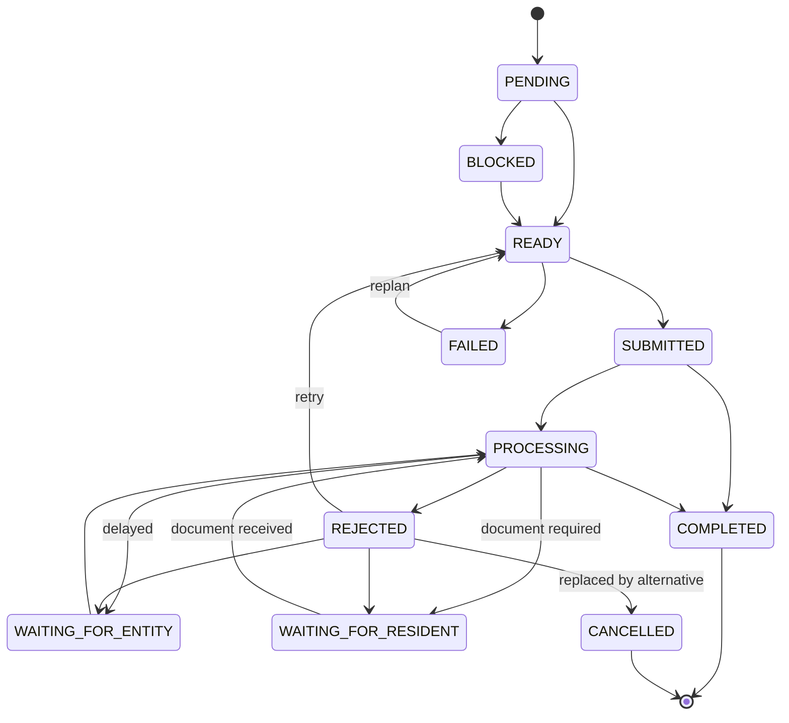

# Workflow engine

The engine is a set of services under `backend/app/services`. None of this logic lives in React.

## Responsibilities

1. **Load** the workflow definition (`WorkflowService.definition`).
2. **Create tasks** and per-case dependencies (`OrchestrationService.activate_case`).
3. **Evaluate dependencies** (`DependencyService.resolve`).
4. **Determine executable tasks** (`READY`).
5. **Submit** them (`submit_ready_tasks` -> adapter, idempotent).
6. **Listen** for entity events (`ingest_entity_event`).
7. **Update state** through the single validated `transition`.
8. **Unlock dependants** (handler on `TASK_COMPLETED`).
9. **Replan** on delay / rejection / missing document / failure.
10. **Trigger callbacks** via the notification policy.
11. **Complete the case** when every non-cancelled task is `COMPLETED`.

## The BIRTH graph

```
BIRTH_REPORTED (system)
        |
BIRTH_REGISTRATION        Birth Registration Authority
        |
BIRTH_CERTIFICATE         Birth Registration Authority
        |----------------------+
IDENTITY_PROCESS         HEALTH_PROCESS            (parallel)
 (Civil Identity)         (Health / Insurance)
        |                       |
ADDITIONAL_SERVICES             |
        +-----------+-----------+
                CASE_COMPLETE (system)
```

System nodes (`BIRTH_REPORTED`, `CASE_COMPLETE`) have no authority: they complete themselves the moment they become `READY`, which is how the case root and completion are also just graph nodes. The dependency layers used for layout come from `topological_layers`.

## Task state machine (`services/state_machine.py`)



Invalid transitions raise `InvalidTransition` (HTTP 409). Every state has an explicit rule (unit-tested).

## Dependency-aware replanning

`ExceptionAgent.decide_rejection` walks a ladder; `ReplanningService` executes it.

| Situation | Decision | Effect |
|---|---|---|
| **Delay** | wait | Task -> `WAITING_FOR_ENTITY`. Dependants stay `BLOCKED` (a `DEPENDENCY_BLOCKED` event lists them). **No call** unless the delay is >= 72h. Parallel branches continue. |
| **Additional information** | ask resident | Task -> `WAITING_FOR_RESIDENT`, `Document` rows `REQUESTED`, callback scheduled. Case stays open. |
| **Rejection, retryable, attempts left** | retry | New idempotency key, resubmit. Silent (no call). |
| **Rejection, alternative configured** | alternative path | Old task `CANCELLED`; alternative task created with the same prerequisites; dependants are **rewired** to it; resident is told. |
| **Rejection, temporary** | wait | Task -> `WAITING_FOR_ENTITY`. |
| **Otherwise / submission failed** | human escalation | Case -> `ESCALATED`, callback "a human officer will review". |

The BIRTH identity node configures `IDENTITY_MANUAL_REVIEW` as the permitted alternative and `max_attempts = 2`. `POST /demo/.../replan_workflow` (and `ReplanningService.replan_case`) re-evaluates the whole graph on demand: it requeues failed tasks, resumes an escalated case and starts anything unblocked.

## Case lifecycle

`PENDING_CONSENT` -> (service-initiation consent) -> `IN_PROGRESS` <-> `PAUSED` / `ESCALATED` -> `COMPLETED`. While `PAUSED`, tasks may unlock (`READY`) but nothing is submitted and no callbacks are placed; resuming submits whatever is ready.

## Idempotency

- Task submission: `idempotency_key = "<case>:<node>:1"` (`:retryN` on retries). The adapter returns the existing application for a repeated key.
- Entity events: `entity:<application>:<kind>` (+ counter for repeatable kinds). A repeated key, or an event that would not change state, is acknowledged as `duplicate` without side effects.
